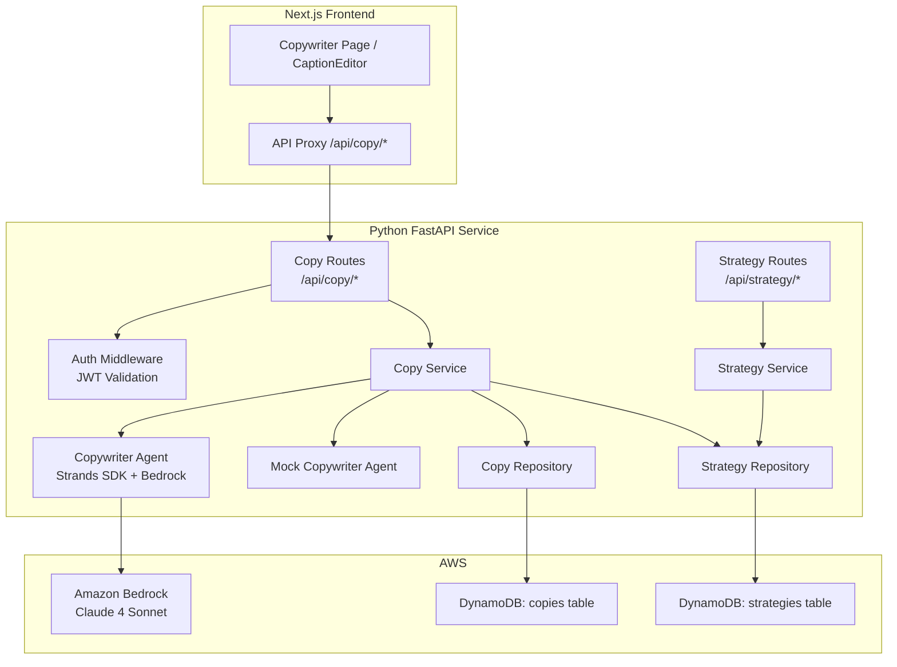
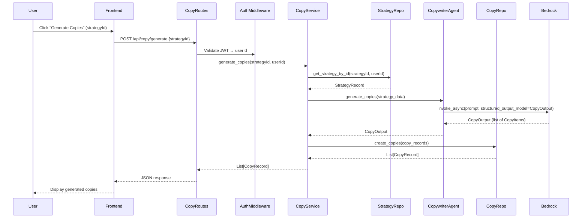
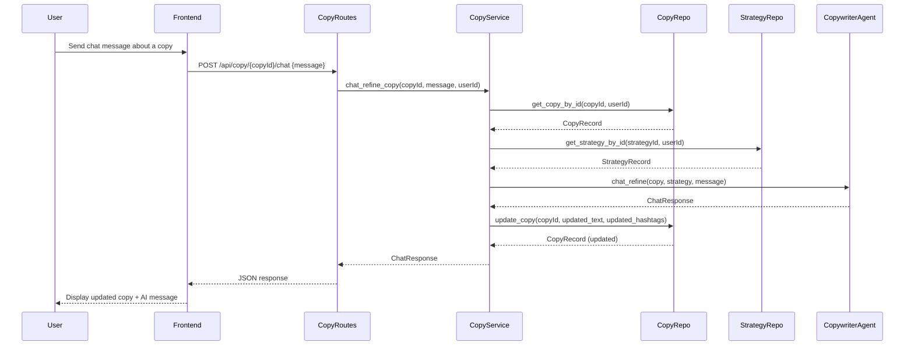
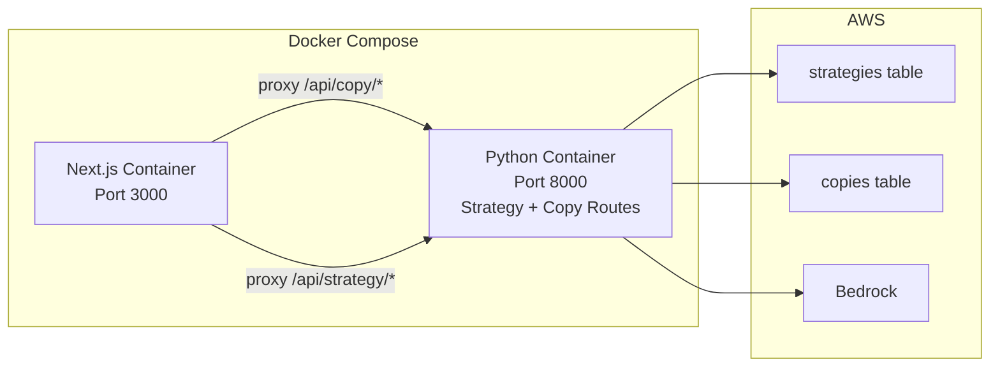

# Design Document: Copywriter Agent Backend

## Overview

The Copywriter Agent Backend extends the existing Python FastAPI service with AI-powered social media copy generation. It consumes strategy data produced by the Strategist Agent and generates platform-specific social media copies (captions with hashtags) tailored to the brand's strategy. Users can also chat with the AI to refine individual copies conversationally.

The architecture follows the same patterns established by the Strategist Agent Backend:
- **FastAPI Routes**: New `/api/copy/*` endpoints registered alongside existing strategy routes
- **Pydantic Models**: Structured input/output validation for copy data
- **DynamoDB Repository**: New `copies` table with GSIs for strategyId and userId queries
- **Strands Agents SDK**: Copywriter agent with Bedrock for AI generation
- **JWT Authentication**: Reuses existing `auth_middleware` for user identity
- **Mock Agent**: Development-friendly mock that returns realistic sample copies

Key design decisions:
- Copies are linked to strategies via `strategyId`, enabling per-strategy copy management
- The copywriter agent fetches strategy data from the strategy repository to use as generation context
- Chat refinement updates existing copy records in-place with `updatedAt` tracking
- The service layer coordinates between the strategy repository (read), copywriter agent (generate), and copy repository (write)

## Architecture

### System Components



### Copy Generation Flow



### Chat Refinement Flow



### Deployment (extends existing Docker Compose)



## Components and Interfaces

### 1. Pydantic Models (`python/models/copy.py`)

```python
from datetime import datetime, UTC
from typing import List
from uuid import uuid4
from pydantic import BaseModel, Field, field_validator, ConfigDict


class CopyGenerateInput(BaseModel):
    """Input model for copy generation requests."""
    strategy_id: str = Field(
        ...,
        min_length=1,
        description="ID of the strategy to generate copies from"
    )

    @field_validator('strategy_id')
    @classmethod
    def validate_non_empty(cls, v: str) -> str:
        if not v or not v.strip():
            raise ValueError('strategy_id cannot be empty or whitespace only')
        return v.strip()


class CopyItem(BaseModel):
    """A single generated copy item from the agent."""
    text: str = Field(..., description="The post caption text")
    platform: str = Field(..., description="Target social media platform")
    hashtags: List[str] = Field(
        default_factory=list,
        description="List of relevant hashtags"
    )


class CopyOutput(BaseModel):
    """Structured output from the Copywriter Agent."""
    copies: List[CopyItem] = Field(
        ...,
        min_length=1,
        description="List of generated copies, one per platform"
    )


class CopyRecord(BaseModel):
    """Complete copy record for database storage."""
    id: str = Field(
        default_factory=lambda: str(uuid4()),
        description="Unique copy identifier"
    )
    strategy_id: str = Field(..., description="Associated strategy ID")
    user_id: str = Field(..., description="Owner user ID from JWT")
    text: str = Field(..., description="Post caption text")
    platform: str = Field(..., description="Target platform")
    hashtags: List[str] = Field(
        default_factory=list,
        description="Relevant hashtags"
    )
    created_at: datetime = Field(
        default_factory=lambda: datetime.now(UTC),
        description="Creation timestamp"
    )
    updated_at: datetime = Field(
        default_factory=lambda: datetime.now(UTC),
        description="Last modification timestamp"
    )

    model_config = ConfigDict(ser_json_timedelta='iso8601')


class ChatRequest(BaseModel):
    """Input model for chat refinement requests."""
    message: str = Field(
        ...,
        min_length=1,
        description="User message to refine the copy"
    )

    @field_validator('message')
    @classmethod
    def validate_non_empty(cls, v: str) -> str:
        if not v or not v.strip():
            raise ValueError('message cannot be empty or whitespace only')
        return v.strip()


class ChatResponse(BaseModel):
    """Response from chat refinement."""
    updated_text: str = Field(..., description="Updated copy text")
    updated_hashtags: List[str] = Field(
        default_factory=list,
        description="Updated hashtags"
    )
    ai_message: str = Field(
        ...,
        description="AI explanation of changes made"
    )
```

### 2. Copy Repository (`python/repositories/copy_repository.py`)

```python
class CopyRepository:
    """Repository for copy data access in DynamoDB."""

    def __init__(self, table_name: str, region: str):
        dynamodb = boto3.resource('dynamodb', region_name=region)
        self.table = dynamodb.Table(table_name)

    async def create_copy(self, record: CopyRecord) -> CopyRecord:
        """Store a new copy record."""

    async def create_copies(self, records: List[CopyRecord]) -> List[CopyRecord]:
        """Batch store multiple copy records."""

    async def get_copy_by_id(self, copy_id: str, user_id: str = None) -> Optional[CopyRecord]:
        """Retrieve a copy by ID with optional user isolation."""

    async def copy_exists(self, copy_id: str) -> bool:
        """Check if a copy exists regardless of owner."""

    async def list_copies_by_strategy(self, strategy_id: str) -> List[CopyRecord]:
        """List all copies for a strategy, sorted by createdAt descending."""

    async def list_copies_by_user(self, user_id: str) -> List[CopyRecord]:
        """List all copies for a user, sorted by createdAt descending."""

    async def update_copy(self, copy_id: str, text: str, hashtags: List[str]) -> CopyRecord:
        """Update copy text and hashtags, setting updatedAt."""

    async def delete_copy(self, copy_id: str) -> bool:
        """Delete a copy record. Returns True if deleted."""

    def _item_to_record(self, item: dict) -> CopyRecord:
        """Convert DynamoDB item to CopyRecord."""
```

### 3. Copywriter Agent (`python/services/copywriter_agent.py`)

```python
class CopywriterAgent:
    """Production Copywriter Agent using Strands SDK with Bedrock."""

    def __init__(self, aws_region: str, model_id: str, ...):
        # Same Bedrock initialization pattern as StrategistAgent
        self.agent = Agent(
            model=self.model,
            system_prompt=self._get_system_prompt()
        )

    def _get_system_prompt(self) -> str:
        """System prompt instructing the agent to act as a social media copywriter."""

    async def generate_copies(self, strategy_data: dict) -> CopyOutput:
        """Generate copies from strategy data using structured output."""
        result = await self.agent.invoke_async(prompt, structured_output_model=CopyOutput)
        return result.structured_output

    async def chat_refine(
        self, copy_text: str, platform: str, hashtags: List[str],
        strategy_data: dict, user_message: str
    ) -> ChatResponse:
        """Refine a copy via conversational chat."""
        result = await self.agent.invoke_async(prompt, structured_output_model=ChatResponse)
        return result.structured_output
```

### 4. Mock Copywriter Agent (`python/services/mock_copywriter_agent.py`)

```python
class MockCopywriterAgent:
    """Mock implementation for development without AWS."""

    async def generate_copies(self, strategy_data: dict) -> CopyOutput:
        """Return realistic sample copies with simulated delay."""

    async def chat_refine(
        self, copy_text: str, platform: str, hashtags: List[str],
        strategy_data: dict, user_message: str
    ) -> ChatResponse:
        """Return a mock chat response with simulated delay."""
```

### 5. Copy Service (`python/services/copy_service.py`)

```python
class CopyService:
    """Business logic for copy generation, retrieval, and chat refinement."""

    def __init__(self, agent, copy_repository, strategy_repository):
        self.agent = agent
        self.copy_repository = copy_repository
        self.strategy_repository = strategy_repository

    async def generate_copies(
        self, strategy_id: str, user_id: str
    ) -> List[CopyRecord]:
        """
        Generate copies from a strategy.
        1. Fetch strategy (verify ownership)
        2. Call agent with strategy data
        3. Store each copy in DB
        """

    async def get_copies_by_strategy(
        self, strategy_id: str, user_id: str
    ) -> List[CopyRecord]:
        """Retrieve copies for a strategy (verify strategy ownership)."""

    async def get_copy(
        self, copy_id: str, user_id: str
    ) -> tuple[Optional[CopyRecord], bool]:
        """Get a copy by ID with user isolation. Returns (record, belongs_to_other)."""

    async def chat_refine_copy(
        self, copy_id: str, message: str, user_id: str
    ) -> tuple[ChatResponse, CopyRecord]:
        """
        Chat to refine a copy.
        1. Fetch copy (verify ownership)
        2. Fetch associated strategy for context
        3. Call agent chat
        4. Update copy in DB
        """

    async def delete_copy(
        self, copy_id: str, user_id: str
    ) -> tuple[bool, bool]:
        """Delete a copy. Returns (deleted, belongs_to_other)."""
```

### 6. Copy Routes (`python/routes/copy.py`)

```python
router = APIRouter(prefix="/api/copy", tags=["copy"])

@router.post("/generate", response_model=List[CopyRecord])
async def generate_copies(input: CopyGenerateInput, user_id = Depends(auth)):
    """Generate copies from a strategy."""

@router.get("/list/{strategy_id}", response_model=List[CopyRecord])
async def list_copies(strategy_id: str, user_id = Depends(auth)):
    """List all copies for a strategy."""

@router.get("/{copy_id}", response_model=CopyRecord)
async def get_copy(copy_id: str, user_id = Depends(auth)):
    """Get a specific copy by ID."""

@router.post("/{copy_id}/chat", response_model=ChatResponse)
async def chat_refine(copy_id: str, req: ChatRequest, user_id = Depends(auth)):
    """Chat to refine a specific copy."""

@router.delete("/{copy_id}", status_code=204)
async def delete_copy(copy_id: str, user_id = Depends(auth)):
    """Delete a specific copy."""
```

### 7. Configuration Updates (`python/config.py`)

Add to existing `Settings`:
```python
# DynamoDB Configuration (add)
dynamodb_copies_table: str = "copies-dev"
```

### 8. Main App Registration (`python/main.py`)

```python
from routes.copy import router as copy_router
app.include_router(copy_router)
```

## Data Models

### DynamoDB Table: copies

**Table Structure:**
- **Primary Key**: `copyId` (String) - Partition key
- **GSI: StrategyIdIndex**: hash_key=`strategyId`, range_key=`createdAt`
- **GSI: UserIdIndex**: hash_key=`userId`, range_key=`createdAt`

**Item Schema:**
```json
{
  "copyId": "uuid-v4-string",
  "strategyId": "uuid-v4-string",
  "userId": "uuid-v4-string",
  "text": "string (post caption)",
  "platform": "string (instagram|twitter|linkedin|facebook)",
  "hashtags": ["#hashtag1", "#hashtag2"],
  "createdAt": "ISO-8601-timestamp",
  "updatedAt": "ISO-8601-timestamp"
}
```

**Terraform Configuration (`terraform/copies-table.tf`):**
```hcl
resource "aws_dynamodb_table" "copies" {
  name           = "copies-${var.environment}"
  billing_mode   = "PAY_PER_REQUEST"
  hash_key       = "copyId"

  attribute {
    name = "copyId"
    type = "S"
  }

  attribute {
    name = "strategyId"
    type = "S"
  }

  attribute {
    name = "userId"
    type = "S"
  }

  attribute {
    name = "createdAt"
    type = "S"
  }

  global_secondary_index {
    name            = "StrategyIdIndex"
    hash_key        = "strategyId"
    range_key       = "createdAt"
    projection_type = "ALL"
  }

  global_secondary_index {
    name            = "UserIdIndex"
    hash_key        = "userId"
    range_key       = "createdAt"
    projection_type = "ALL"
  }

  point_in_time_recovery {
    enabled = true
  }

  server_side_encryption {
    enabled = true
  }

  tags = {
    Name        = "Copies Table"
    Environment = var.environment
    ManagedBy   = "Terraform"
    Application = "CopywriterAgent"
  }
}
```

### Frontend-Backend Data Flow

**Copy Generation Request:**
```
Frontend: POST /api/copy/generate
Body: { "strategy_id": "abc-123" }
Headers: Authorization: Bearer <jwt>

→ Python validates JWT → extracts userId
→ Fetches StrategyRecord(id="abc-123", userId=userId)
→ Passes strategy data to CopywriterAgent
→ Agent returns CopyOutput { copies: [...] }
→ Each CopyItem stored as CopyRecord in copies table
→ Returns List[CopyRecord] as JSON
```

**Chat Refinement Request:**
```
Frontend: POST /api/copy/{copyId}/chat
Body: { "message": "Make it more casual and add emojis" }
Headers: Authorization: Bearer <jwt>

→ Python validates JWT → extracts userId
→ Fetches CopyRecord(id=copyId, userId=userId)
→ Fetches associated StrategyRecord for brand context
→ Passes copy + strategy + message to CopywriterAgent.chat_refine()
→ Agent returns ChatResponse { updated_text, updated_hashtags, ai_message }
→ Updates CopyRecord in DB with new text/hashtags/updatedAt
→ Returns ChatResponse as JSON
```


## Correctness Properties

*A property is a characteristic or behavior that should hold true across all valid executions of a system—essentially, a formal statement about what the system should do. Properties serve as the bridge between human-readable specifications and machine-verifiable correctness guarantees.*

### Property Reflection

After analyzing all acceptance criteria across 10 requirements, the following consolidations eliminate redundancy:

**Consolidated Properties:**
- Criteria 1.4, 1.5, 1.6 (CopyItem fields) → Combined into "CopyItem structural completeness" (covered by Pydantic round-trip)
- Criteria 2.2–2.7 (CopyRecord fields) → Combined into "CopyRecord completeness"
- Criteria 1.9, 3.2, 3.6, 4.9, 6.1–6.4 (user isolation across generate, list, get, chat, delete) → Combined into one "user isolation" property
- Criteria 10.1, 10.5 (input validation for CopyGenerateInput and ChatRequest) → Combined into "input validation rejects whitespace"
- Criteria 10.2–10.4, 10.6, 10.7, 1.7 (Pydantic model serialization) → Combined into "Pydantic JSON round-trip"
- Criteria 2.1, 3.1 (store then retrieve copies) → Combined into "copy persistence round-trip"
- Criteria 4.6, 4.7 (chat updates copy text and updatedAt) → Combined into "chat refinement updates copy"
- Criteria 7.4, 7.5 (errors don't store/modify records) → Combined into "errors preserve data integrity"

**Removed as redundant:**
- 6.5 (enforce at repository level) is an architectural constraint, not a testable property — covered by the user isolation property
- 1.3 (generate copies per platform) is dependent on AI behavior and mock agent output structure — tested via example, not property

**Final Property Set: 10 properties**

### Property 1: Input Validation Rejects Whitespace

*For any* string composed entirely of whitespace (or empty), submitting it as `strategy_id` in CopyGenerateInput or as `message` in ChatRequest should be rejected with a validation error, and no side effects should occur.

**Validates: Requirements 10.1, 10.5**

### Property 2: Pydantic Model JSON Serialization Round-Trip

*For any* valid CopyItem, CopyOutput, CopyRecord, ChatRequest, or ChatResponse Pydantic model instance, serializing to JSON and deserializing back should produce an equivalent object.

**Validates: Requirements 1.7, 10.2, 10.3, 10.4, 10.6, 10.7**

### Property 3: Copy Persistence Round-Trip

*For any* successfully generated set of copies, querying the copies table by strategyId should return all the generated CopyRecords with matching text, platform, hashtags, strategyId, and userId.

**Validates: Requirements 2.1, 3.1**

### Property 4: CopyRecord Completeness

*For any* CopyRecord stored in the database, it should contain all required fields: a non-empty copyId (unique), a non-empty strategyId, a non-empty userId, non-empty text, non-empty platform, a hashtags list, a valid createdAt timestamp, and a valid updatedAt timestamp.

**Validates: Requirements 2.2, 2.3, 2.4, 2.5, 2.6, 2.7**

### Property 5: User Isolation Across All Copy Operations

*For any* two distinct users A and B, if user A creates copies, then user B should not be able to: retrieve those copies by ID (403), list copies for user A's strategy (403), chat-refine user A's copies (403), or delete user A's copies (403). User B's copy list should never contain user A's records.

**Validates: Requirements 1.9, 3.2, 3.6, 4.9, 6.1, 6.2, 6.3, 6.4**

### Property 6: Authentication Required for All Copy Endpoints

*For any* request to a copy endpoint (/api/copy/generate, /api/copy/list/{id}, /api/copy/{id}, /api/copy/{id}/chat, /api/copy/{id}), if the JWT token is missing, expired, or invalid, the system should return a 401 status code.

**Validates: Requirements 5.6**

### Property 7: Copies Sorted by CreatedAt Descending

*For any* strategy with multiple copies, retrieving copies via the list endpoint should return them ordered by createdAt timestamp in descending order (newest first).

**Validates: Requirements 3.3**

### Property 8: Chat Refinement Updates Copy and Timestamp

*For any* successful chat refinement on a copy, the CopyRecord in the database should reflect the updated text and hashtags from the ChatResponse, and the updatedAt timestamp should be greater than or equal to the original updatedAt.

**Validates: Requirements 4.6, 4.7**

### Property 9: Errors Preserve Data Integrity

*For any* copy generation request that fails (agent error, timeout, Bedrock failure), no new CopyRecords should be created in the database. *For any* chat refinement that fails, the existing CopyRecord should remain unchanged.

**Validates: Requirements 7.4, 7.5**

### Property 10: Mock Agent Interface Compatibility

*For any* valid input accepted by the real CopywriterAgent's `generate_copies` and `chat_refine` methods, the MockCopywriterAgent should also accept the same input and return the same Pydantic model types (CopyOutput and ChatResponse respectively).

**Validates: Requirements 9.4**

## Error Handling

### Error Categories and Responses

#### 1. Authentication Errors (401)
- **Trigger**: Missing, expired, or invalid JWT token on any copy endpoint
- **Response**: `{"detail": "Invalid token"}` or `{"detail": "Token has expired"}`
- **Logging**: Log token validation failure (no token content)

#### 2. Authorization Errors (403)
- **Trigger**: User attempts to access/modify a copy or strategy belonging to another user
- **Response**: `{"detail": "Access denied: You do not have permission to access this resource"}`
- **Logging**: Log userId, requested resourceId, and timestamp

#### 3. Validation Errors (400/422)
- **Trigger**: Invalid CopyGenerateInput (empty strategyId) or ChatRequest (empty message)
- **Response**: `{"detail": [{"field": "strategy_id", "message": "Field required"}]}`
- **Logging**: Log validation errors with sanitized input

#### 4. Not Found Errors (404)
- **Trigger**: strategyId or copyId does not exist
- **Response**: `{"detail": "Strategy not found"}` or `{"detail": "Copy not found"}`
- **Logging**: Log requested ID and userId

#### 5. Agent Errors (500)
- **Trigger**: Copywriter agent throws exception during generation or chat
- **Response**: `{"detail": "Copy generation failed. Please try again."}`
- **Logging**: Log full exception stack trace, input parameters

#### 6. Structured Output Errors (500)
- **Trigger**: Agent completes but structured_output is None or invalid
- **Response**: `{"detail": "Failed to generate structured copy output"}`
- **Logging**: Log agent response and validation errors

#### 7. Service Unavailable (503)
- **Trigger**: Bedrock service unreachable or returns AWS errors
- **Response**: `{"detail": "AI service temporarily unavailable. Please try again later."}`
- **Logging**: Log Bedrock error response

#### 8. Timeout Errors (504)
- **Trigger**: Agent execution exceeds 60 seconds
- **Response**: `{"detail": "Copy generation timed out. Please try again."}`
- **Logging**: Log execution time and input

### Error Handling Implementation Pattern

The copy routes follow the same error handling pattern as strategy routes:

```python
@router.post("/generate", response_model=List[CopyRecord])
async def generate_copies(
    copy_input: CopyGenerateInput,
    user_id: str = Depends(auth_middleware.get_current_user)
):
    try:
        records = await asyncio.wait_for(
            copy_service.generate_copies(copy_input.strategy_id, user_id),
            timeout=settings.agent_timeout_seconds
        )
        return records
    except asyncio.TimeoutError:
        raise HTTPException(status_code=504, detail="Copy generation timed out")
    except StructuredOutputException:
        raise HTTPException(status_code=500, detail="Failed to generate structured copy output")
    except (BotoCoreError, ClientError):
        raise HTTPException(status_code=503, detail="AI service temporarily unavailable")
    except HTTPException:
        raise  # Re-raise 403, 404
    except Exception as e:
        logger.error(f"Copy generation failed: {str(e)}", exc_info=True)
        raise HTTPException(status_code=500, detail="Copy generation failed")
```

### Data Integrity During Errors

The service layer ensures atomicity:
1. **Generation**: Strategy is fetched first, then agent is called, then copies are stored. If the agent fails, no copies are written.
2. **Chat**: Copy is fetched, agent is called, then copy is updated. If the agent fails, the original copy remains unchanged.

## Testing Strategy

### Dual Testing Approach

The testing strategy combines unit tests for specific scenarios and property-based tests for universal correctness properties.

#### Unit Tests
- Specific examples of valid/invalid inputs (empty strategyId, non-existent copyId)
- Edge cases (no copies for a strategy, deleting already-deleted copy)
- Error conditions (Bedrock failures, timeouts, invalid tokens)
- Integration points (JWT validation, DynamoDB operations, strategy fetching)

#### Property-Based Tests
Property-based tests verify universal properties across randomized inputs using the `hypothesis` library for Python. Each property test:
- Runs minimum 100 iterations
- Generates diverse test data
- References the design document property in a comment tag
- Is implemented as a SINGLE property-based test per correctness property

### Property Test Configuration

**Library**: `hypothesis` (Python property-based testing library)
**Tag Format**: `Feature: copywriter-agent-backend, Property {number}: {property_text}`

### Test Organization

```
python/tests/
├── test_copy_models.py                    # Unit tests for Pydantic models
├── test_copy_repository.py                # Unit tests for DynamoDB operations
├── test_copy_service.py                   # Unit tests for service layer
├── test_copy_routes.py                    # Unit tests for API endpoints
├── test_mock_copywriter_agent.py          # Unit tests for mock agent
├── test_copy_input_validation_property.py # Property 1: Input validation
├── test_copy_serialization_property.py    # Property 2: JSON round-trip
├── test_copy_persistence_property.py      # Property 3: Persistence round-trip
├── test_copy_record_completeness_property.py # Property 4: Record completeness
├── test_copy_user_isolation_property.py   # Property 5: User isolation
├── test_copy_auth_property.py             # Property 6: Authentication
├── test_copy_sorting_property.py          # Property 7: Sorting
├── test_copy_chat_update_property.py      # Property 8: Chat updates
├── test_copy_error_integrity_property.py  # Property 9: Error integrity
└── test_copy_mock_interface_property.py   # Property 10: Mock compatibility
```

### Example Property Tests

#### Property 1: Input Validation
```python
# Feature: copywriter-agent-backend, Property 1: Input Validation Rejects Whitespace
@settings(max_examples=100)
@given(
    whitespace_str=st.from_regex(r'^\s*$', fullmatch=True)
)
def test_property_input_validation_rejects_whitespace(whitespace_str: str):
    """For any whitespace-only string, CopyGenerateInput and ChatRequest should reject it."""
    with pytest.raises(ValidationError):
        CopyGenerateInput(strategy_id=whitespace_str)
    with pytest.raises(ValidationError):
        ChatRequest(message=whitespace_str)
```

#### Property 2: JSON Serialization Round-Trip
```python
# Feature: copywriter-agent-backend, Property 2: Pydantic Model JSON Serialization Round-Trip
@settings(max_examples=100)
@given(
    text=st.text(min_size=1, max_size=500),
    platform=st.sampled_from(["instagram", "twitter", "linkedin", "facebook"]),
    hashtags=st.lists(st.text(min_size=1, max_size=30), min_size=0, max_size=10)
)
def test_property_copy_item_json_round_trip(text: str, platform: str, hashtags: list):
    """For any valid CopyItem, JSON round-trip should preserve equality."""
    original = CopyItem(text=text, platform=platform, hashtags=hashtags)
    json_str = original.model_dump_json()
    restored = CopyItem.model_validate_json(json_str)
    assert restored == original
```

#### Property 5: User Isolation
```python
# Feature: copywriter-agent-backend, Property 5: User Isolation Across All Copy Operations
@settings(max_examples=100)
@given(
    user_a_id=st.uuids().map(str),
    user_b_id=st.uuids().map(str)
)
async def test_property_user_isolation(user_a_id, user_b_id, copy_service):
    """For any two distinct users, one cannot access the other's copies."""
    assume(user_a_id != user_b_id)

    # User A generates copies
    records = await copy_service.generate_copies(strategy_id, user_a_id)

    # User B tries to access each copy
    for record in records:
        result, belongs_to_other = await copy_service.get_copy(record.id, user_b_id)
        assert result is None
        assert belongs_to_other is True
```

#### Property 7: Sorting
```python
# Feature: copywriter-agent-backend, Property 7: Copies Sorted by CreatedAt Descending
@settings(max_examples=100)
@given(
    num_copies=st.integers(min_value=2, max_value=10)
)
async def test_property_copies_sorted_descending(num_copies, copy_repository):
    """For any set of copies, listing should return them newest-first."""
    # Create copies with varying timestamps
    # ...
    copies = await copy_repository.list_copies_by_strategy(strategy_id)
    timestamps = [c.created_at for c in copies]
    assert timestamps == sorted(timestamps, reverse=True)
```

#### Property 9: Error Integrity
```python
# Feature: copywriter-agent-backend, Property 9: Errors Preserve Data Integrity
@settings(max_examples=100)
@given(
    strategy_id=st.uuids().map(str),
    user_id=st.uuids().map(str)
)
async def test_property_errors_preserve_data_integrity(
    strategy_id, user_id, failing_copy_service, copy_repository
):
    """For any failed generation, no copies should be stored."""
    try:
        await failing_copy_service.generate_copies(strategy_id, user_id)
    except Exception:
        pass
    copies = await copy_repository.list_copies_by_strategy(strategy_id)
    assert len(copies) == 0
```

### Mock Agent for Testing

```python
@pytest.fixture
def mock_copywriter_agent():
    """Mock agent returning predictable copy data."""
    mock = AsyncMock()
    mock.generate_copies.return_value = CopyOutput(
        copies=[
            CopyItem(text="Sample Instagram post", platform="instagram", hashtags=["#brand", "#social"]),
            CopyItem(text="Sample LinkedIn post", platform="linkedin", hashtags=["#professional"]),
        ]
    )
    mock.chat_refine.return_value = ChatResponse(
        updated_text="Refined copy text",
        updated_hashtags=["#updated"],
        ai_message="I made the tone more casual as requested."
    )
    return mock
```
