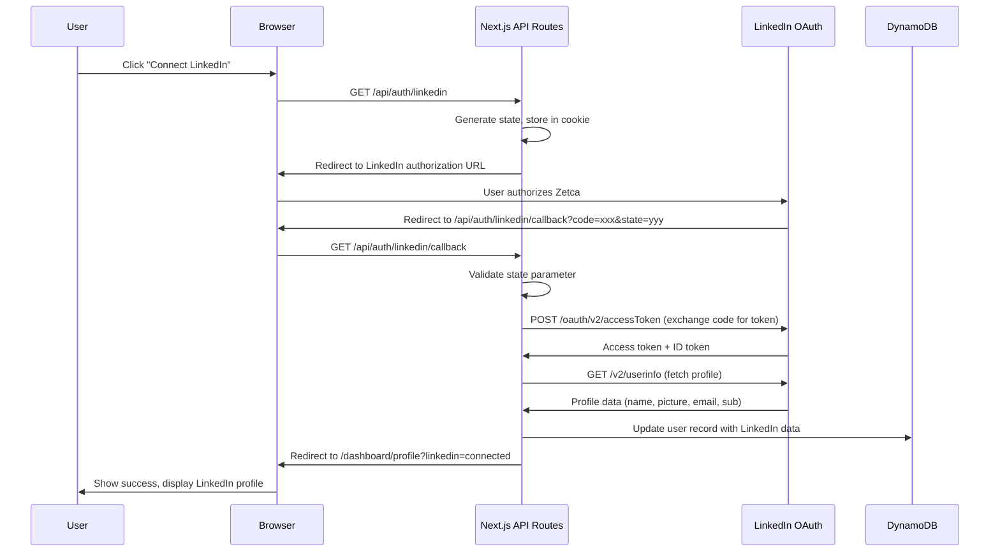

# Design Document: LinkedIn OAuth 2.0 Integration

## Overview

This design describes the integration of LinkedIn OAuth 2.0 into the Zetca platform, enabling users to connect their LinkedIn accounts for future content publishing. The integration uses LinkedIn's OpenID Connect (OIDC) flow combined with the "Share on LinkedIn" permission scope.

The architecture leverages the existing Next.js API routes for the OAuth flow (since it requires server-side secret handling), the existing DynamoDB user table for storing LinkedIn connection data, and the existing profile page UI for displaying connection status.

Key design decisions:
- **Server-side OAuth flow**: The entire token exchange happens in Next.js API routes (not the Python backend) because it requires the LinkedIn Client Secret and is tightly coupled with user session management
- **Single DynamoDB table**: LinkedIn fields are added as optional attributes to the existing `users` table rather than creating a separate table
- **No separate LinkedIn login**: This integration is for account linking only (connecting LinkedIn to an existing Zetca account), not for signing into Zetca with LinkedIn

## Architecture

### OAuth 2.0 Flow



### System Components

```
┌─────────────────────────────────────────────────────────────┐
│                     Next.js Frontend                         │
│                                                              │
│  ┌──────────────────┐  ┌──────────────────────────────┐    │
│  │  Profile Page     │  │  Dashboard Layout             │    │
│  │  - Connect btn    │  │  - LinkedIn avatar in header  │    │
│  │  - Status display │  │  - Connected account badge    │    │
│  │  - Disconnect btn │  └──────────────────────────────┘    │
│  └──────────────────┘                                        │
│                                                              │
│  ┌──────────────────────────────────────────────────────┐   │
│  │              API Routes (Server-Side)                 │   │
│  │                                                        │   │
│  │  GET  /api/auth/linkedin          → Initiate OAuth    │   │
│  │  GET  /api/auth/linkedin/callback → Handle callback   │   │
│  │  POST /api/auth/linkedin/disconnect → Remove tokens   │   │
│  │  GET  /api/profile                → Include LinkedIn  │   │
│  └──────────────────────────────────────────────────────┘   │
│                            │                                 │
└────────────────────────────┼─────────────────────────────────┘
                             │
                    ┌────────┴────────┐
                    │    DynamoDB     │
                    │  users table    │
                    │  + LinkedIn     │
                    │    fields       │
                    └─────────────────┘
```

## Components and Interfaces

### 1. API Routes

#### GET /api/auth/linkedin (Initiate OAuth)
```typescript
// app/api/auth/linkedin/route.ts
// Protected: requires authenticated user (JWT cookie)
// 
// 1. Verify user is authenticated via withAuth middleware
// 2. Generate cryptographically random state (32 bytes, hex encoded)
// 3. Store state in HTTP-only cookie (linkedin_oauth_state, 10 min expiry)
// 4. Build LinkedIn authorization URL with params:
//    - response_type: code
//    - client_id: from env LINKEDIN_CLIENT_ID
//    - redirect_uri: from env LINKEDIN_REDIRECT_URI
//    - state: generated state
//    - scope: openid profile email w_member_social
// 5. Return redirect response to LinkedIn URL
```

#### GET /api/auth/linkedin/callback (Handle Callback)
```typescript
// app/api/auth/linkedin/callback/route.ts
// Protected: requires authenticated user (JWT cookie)
//
// 1. Extract code, state, error from query params
// 2. If error param present, redirect to profile with error
// 3. Validate state matches cookie value
// 4. Exchange code for tokens:
//    POST https://www.linkedin.com/oauth/v2/accessToken
//    Body: grant_type, code, redirect_uri, client_id, client_secret
// 5. Call UserInfo endpoint with access token:
//    GET https://api.linkedin.com/v2/userinfo
//    Header: Authorization: Bearer <token>
// 6. Update user record in DynamoDB with LinkedIn data
// 7. Clear linkedin_oauth_state cookie
// 8. Redirect to /dashboard/profile?linkedin=connected
```

#### POST /api/auth/linkedin/disconnect (Disconnect)
```typescript
// app/api/auth/linkedin/disconnect/route.ts
// Protected: requires authenticated user (JWT cookie)
//
// 1. Verify user is authenticated
// 2. Clear LinkedIn fields from user record in DynamoDB
// 3. Return success response
```

### 2. Database Schema Changes

#### Updated UserRecord (DynamoDB)
```typescript
// Added optional LinkedIn fields to existing UserRecord
export interface UserRecord {
  userId: string;           // Primary Key (existing)
  email: string;            // GSI (existing)
  passwordHash: string;     // existing
  name: string;             // existing
  company?: string;         // existing
  bio?: string;             // existing
  createdAt: string;        // existing
  lastModified: string;     // existing
  
  // New LinkedIn fields (all optional)
  linkedinSub?: string;           // LinkedIn member identifier
  linkedinAccessToken?: string;   // OAuth access token for API calls
  linkedinName?: string;          // LinkedIn display name
  linkedinPictureUrl?: string;    // LinkedIn profile picture URL
  linkedinEmail?: string;         // LinkedIn email
  linkedinConnectedAt?: string;   // ISO 8601 timestamp of connection
}
```

#### UserRepository Updates
```typescript
// New methods added to existing UserRepository class

/**
 * Update LinkedIn connection data for a user
 */
async connectLinkedIn(userId: string, linkedinData: {
  linkedinSub: string;
  linkedinAccessToken: string;
  linkedinName: string;
  linkedinPictureUrl?: string;
  linkedinEmail?: string;
}): Promise<UserRecord>

/**
 * Remove LinkedIn connection data from a user
 */
async disconnectLinkedIn(userId: string): Promise<UserRecord>
```

### 3. Frontend Components

#### ProfileForm Updates
```typescript
// Updated connected accounts section in ProfileForm
// Changes:
// - Fetch LinkedIn connection status from /api/profile response
// - LinkedIn "Connect" button triggers GET /api/auth/linkedin (full page redirect)
// - If connected, show LinkedIn name, picture, and "Disconnect" button
// - "Disconnect" calls POST /api/auth/linkedin/disconnect
// - Handle ?linkedin=connected query param to show success message
// - Handle ?linkedin_error=xxx query param to show error message
```

#### Dashboard Layout Updates
```typescript
// Updated header in dashboard layout
// Changes:
// - Fetch LinkedIn data from /api/profile (already called by AuthContext)
// - If LinkedIn connected, show small avatar + name badge near user menu
// - Use next/image for LinkedIn profile picture with linkedin domain allowed
```

### 4. TypeScript Types Updates

#### Updated ConnectedAccount type
```typescript
// types/user.ts
export interface ConnectedAccount {
  platform: 'instagram' | 'twitter' | 'linkedin' | 'facebook';
  isConnected: boolean;
  username?: string;
  profilePictureUrl?: string;  // NEW: for LinkedIn profile picture
  connectedAt?: Date;
}

// New type for LinkedIn profile data in API responses
export interface LinkedInProfile {
  sub: string;
  name: string;
  pictureUrl?: string;
  email?: string;
  connectedAt: string;
}
```

### 5. Environment Variables

```bash
# New environment variables to add to .env.local
LINKEDIN_CLIENT_ID=your-linkedin-client-id
LINKEDIN_CLIENT_SECRET=your-linkedin-client-secret
LINKEDIN_REDIRECT_URI=http://localhost:3000/api/auth/linkedin/callback
```

### 6. Next.js Configuration Updates

```typescript
// next.config.ts - add LinkedIn image domain
images: {
  remotePatterns: [
    // existing unsplash pattern...
    {
      protocol: 'https',
      hostname: 'media.licdn-ei.com',  // LinkedIn profile pictures
      pathname: '/**',
    },
    {
      protocol: 'https',
      hostname: '*.licdn.com',  // LinkedIn CDN variants
      pathname: '/**',
    },
  ],
},
```

## Data Models

### LinkedIn Connection Data in DynamoDB

The LinkedIn data is stored as additional attributes on the existing `users` table. No new table or GSI is needed.

```
{
  "userId": "uuid-v4",              // existing PK
  "email": "user@example.com",      // existing
  "name": "John Doe",               // existing
  ...existing fields...
  
  // LinkedIn fields (added when user connects)
  "linkedinSub": "782bbtaQ",
  "linkedinAccessToken": "AQV...",   // encrypted at rest by DynamoDB SSE
  "linkedinName": "John Doe",
  "linkedinPictureUrl": "https://media.licdn-ei.com/...",
  "linkedinEmail": "john@linkedin.com",
  "linkedinConnectedAt": "2026-03-20T10:30:00.000Z"
}
```

### API Response Shape

#### GET /api/profile (updated response)
```json
{
  "success": true,
  "user": {
    "id": "uuid",
    "email": "user@example.com",
    "name": "John Doe",
    "company": "Acme Inc",
    "bio": "...",
    "linkedin": {
      "isConnected": true,
      "name": "John Doe",
      "pictureUrl": "https://media.licdn-ei.com/...",
      "email": "john@linkedin.com",
      "connectedAt": "2026-03-20T10:30:00.000Z"
    }
  }
}
```

When LinkedIn is not connected, the `linkedin` field is:
```json
{
  "linkedin": {
    "isConnected": false
  }
}
```

## Correctness Properties

### Property Reflection

After analyzing all acceptance criteria, the following consolidations were identified:

**Consolidated Properties:**
- Criteria 1.1-1.4 and 6.5 all relate to proper OAuth initiation → Property 1
- Criteria 2.1-2.2 and 6.5 relate to state validation (CSRF) → Property 2
- Criteria 2.3-2.5 relate to token exchange and profile fetch → Property 3
- Criteria 3.1-3.5 and 7.4 relate to profile display → Property 4
- Criteria 5.1-5.3 relate to disconnect → Property 5
- Criteria 6.1-6.2 and 7.5 relate to security → Property 6

### Correctness Properties

Property 1: OAuth Initiation Includes Required Parameters
*For any* OAuth initiation request from an authenticated user, the redirect URL to LinkedIn SHALL contain all required parameters (response_type=code, client_id, redirect_uri, state, scope with openid+profile+email+w_member_social) and the state SHALL be stored in an HTTP-only cookie.
**Validates: Requirements 1.1, 1.2, 1.3, 1.4, 6.5**

Property 2: State Parameter Prevents CSRF
*For any* OAuth callback request, if the state parameter does not match the stored cookie value, the system SHALL reject the request and not exchange the authorization code.
**Validates: Requirements 2.1, 2.2, 6.5**

Property 3: Successful OAuth Stores Complete LinkedIn Data
*For any* successful OAuth callback (valid state, valid code), the system SHALL store the LinkedIn sub, access token, display name, and picture URL in the user's DynamoDB record, and all stored fields SHALL be non-null.
**Validates: Requirements 2.3, 2.4, 2.5, 7.1**

Property 4: Profile API Excludes Access Token
*For any* GET /api/profile response that includes LinkedIn data, the response SHALL contain the LinkedIn name, picture URL, and connection status, but SHALL NOT contain the LinkedIn access token.
**Validates: Requirements 3.6, 7.4, 7.5**

Property 5: Disconnect Removes All LinkedIn Data
*For any* successful disconnect request, the user's DynamoDB record SHALL have all LinkedIn fields (sub, access token, name, picture URL, email, connected timestamp) removed, and subsequent profile fetches SHALL show LinkedIn as not connected.
**Validates: Requirements 5.1, 5.2, 5.3**

Property 6: LinkedIn Credentials Not Hardcoded
*For any* deployment, the LinkedIn Client ID and Client Secret SHALL be read from environment variables and SHALL NOT appear in source code files.
**Validates: Requirements 6.1, 6.6**

## Error Handling

### Error Scenarios

| Scenario | HTTP Status | User Experience |
|---|---|---|
| User denies consent on LinkedIn | N/A (redirect) | Redirect to profile with error message "LinkedIn authorization was denied" |
| State parameter mismatch | N/A (redirect) | Redirect to profile with error "Authorization failed. Please try again." |
| Token exchange fails | N/A (redirect) | Redirect to profile with error "Failed to connect LinkedIn. Please try again." |
| UserInfo API fails | N/A (redirect) | Redirect to profile with error "Failed to retrieve LinkedIn profile. Please try again." |
| User not authenticated | 401 | Redirect to login page |
| Disconnect fails (DB error) | 500 | Show error toast "Failed to disconnect LinkedIn" |
| LinkedIn API rate limited | N/A (redirect) | Redirect to profile with error "LinkedIn is temporarily unavailable. Please try again later." |

### Security Considerations

1. **CSRF Protection**: The `state` parameter is a 32-byte cryptographically random hex string stored in an HTTP-only, SameSite=Lax cookie with a 10-minute expiry
2. **Token Storage**: LinkedIn access tokens are stored in DynamoDB (encrypted at rest via SSE) and never exposed to the frontend
3. **Rate Limiting**: The callback endpoint uses the existing `withRateLimit` middleware
4. **Input Validation**: All data from LinkedIn (name, email, picture URL) is validated and sanitized before storage
5. **Client Secret**: Stored only in environment variables, never in client-side code or API responses

## Testing Strategy

### Unit Tests
- State parameter generation and validation
- LinkedIn URL construction with correct parameters
- Token exchange request formatting
- UserInfo response parsing
- UserRepository LinkedIn methods (connect/disconnect)
- Profile API response shape (with and without LinkedIn data)

### Integration Tests
- Full OAuth flow with mocked LinkedIn endpoints
- Profile page rendering with connected/disconnected states
- Dashboard header with/without LinkedIn avatar
- Disconnect flow end-to-end
