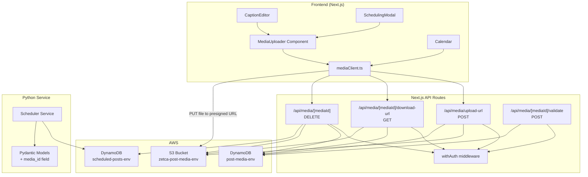
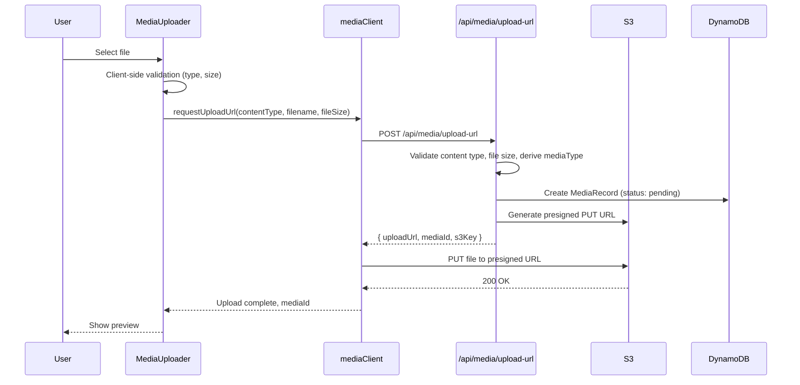

## Overview

This feature adds media attachment capabilities (images and videos) to scheduled posts in the Zetca platform. The system enables users to upload media files directly to S3 via presigned URLs, track media metadata in DynamoDB, and attach media to scheduled posts. The media API is implemented as Next.js API routes under `app/api/media/`, following the same patterns used by existing auth and profile endpoints.

### Key Design Decisions

1. **Presigned URL Upload Pattern**: The browser uploads directly to S3 using presigned URLs, avoiding server-side file handling and keeping the Next.js API routes lightweight. The API route only generates the presigned URL and creates the metadata record.

2. **Next.js API Routes (not Python FastAPI)**: Media CRUD operations live in Next.js API routes to keep the upload/download flow entirely within the frontend's same-origin context. The Python scheduler service only gains an optional `media_id` field on its Pydantic models.

3. **Dual File Size Limits**: Images are capped at 10 MB and videos at 100 MB. The `mediaType` is derived from the content type prefix (`image/` vs `video/`), and the applicable limit is determined server-side before generating the presigned URL.

4. **Shared MediaUploader Component**: A single `MediaUploader` React component is used in both `CaptionEditor` toolbar and `SchedulingModal` form, ensuring consistent upload UX across entry points.

5. **Lazy Presigned Download URLs**: Calendar only fetches download URLs for posts visible in the current month view, avoiding unnecessary S3 presigned URL generation.

## Architecture



### Upload Flow



## Components and Interfaces

### API Routes

#### `POST /api/media/upload-url`
Generates a presigned upload URL and creates a media metadata record.

**Request Body:**
```json
{
  "contentType": "image/jpeg",
  "filename": "photo.jpg",
  "fileSize": 2048576
}
```

**Response (200):**
```json
{
  "uploadUrl": "https://s3.amazonaws.com/...",
  "mediaId": "uuid",
  "s3Key": "{userId}/{mediaId}/{filename}"
}
```

**Error Responses:** 400 (invalid content type, file too large, invalid file size), 401 (unauthenticated)

#### `GET /api/media/[mediaId]/download-url`
Returns a presigned download URL for a media file.

**Response (200):**
```json
{
  "downloadUrl": "https://s3.amazonaws.com/...",
  "mediaId": "uuid",
  "contentType": "image/jpeg",
  "mediaType": "image"
}
```

**Error Responses:** 403 (not owner), 404 (not found), 401 (unauthenticated)

#### `DELETE /api/media/[mediaId]`
Deletes a media file from S3 and its metadata from DynamoDB. Clears any post references.

**Response (200):**
```json
{ "success": true }
```

**Error Responses:** 403 (not owner), 404 (not found), 401 (unauthenticated)

#### `POST /api/media/[mediaId]/validate`
Verifies a media file exists and belongs to the authenticated user. Used before attaching media to a post.

**Response (200):**
```json
{
  "valid": true,
  "mediaId": "uuid",
  "mediaType": "image"
}
```

**Error Responses:** 400 (not found or not owner), 401 (unauthenticated)

### Repository: `lib/db/mediaRepository.ts`

Follows the same pattern as `UserRepository` — instantiates a `DynamoDBDocumentClient` using config from `getConfig()`.

```typescript
class MediaRepository {
  constructor()  // reads config, creates DynamoDB client
  async createMedia(record: MediaRecord): Promise<MediaRecord>
  async getMediaById(mediaId: string): Promise<MediaRecord | null>
  async getMediaByUser(userId: string): Promise<MediaRecord[]>
  async deleteMedia(mediaId: string): Promise<void>
}
```

### API Client: `lib/api/mediaClient.ts`

Follows the same pattern as `copyClient.ts` and `schedulerClient.ts` — uses `getAuthToken()`, `createAuthHeaders()`, and `handleAuthError()`.

```typescript
// Request a presigned upload URL
async function requestUploadUrl(contentType: string, filename: string, fileSize: number): Promise<UploadUrlResponse>

// Upload file directly to S3 using presigned URL
async function uploadFileToS3(uploadUrl: string, file: File): Promise<void>

// Request a presigned download URL
async function getDownloadUrl(mediaId: string): Promise<DownloadUrlResponse>

// Delete a media file
async function deleteMedia(mediaId: string): Promise<void>

// Validate media ownership (used before attaching to post)
async function validateMedia(mediaId: string): Promise<ValidateMediaResponse>
```

### Frontend Component: `components/dashboard/MediaUploader.tsx`

A reusable component used in both CaptionEditor and SchedulingModal.

```typescript
interface MediaUploaderProps {
  onMediaAttached: (mediaId: string, mediaType: 'image' | 'video') => void;
  onMediaRemoved: () => void;
  initialMediaId?: string;       // For pre-filled media from CaptionEditor → SchedulingModal
  initialMediaType?: 'image' | 'video';
  initialMediaUrl?: string;      // Presigned download URL for existing media preview
  disabled?: boolean;
}
```

**Behavior:**
- File input accepts `image/jpeg,image/png,image/gif,image/webp,video/mp4,video/quicktime,video/webm`
- Client-side validation: file type and size (10 MB images, 100 MB videos)
- Shows image thumbnail or video player preview after selection
- Displays upload progress indicator during S3 upload
- Provides remove button to clear selected media
- Calls `onMediaAttached` with `mediaId` after successful upload
- Calls `onMediaRemoved` when user removes media

### Terraform: `terraform/post-media-bucket.tf` and `terraform/post-media-table.tf`

**S3 Bucket:**
- Name: `zetca-post-media-{environment}`
- AES-256 server-side encryption
- Public access blocked
- Lifecycle rule: transition to IA after 90 days
- CORS configuration for browser PUT uploads

**DynamoDB Table:**
- Name: `post-media-{environment}`
- Hash key: `mediaId` (S)
- GSI: `UserIdIndex` — hash key `userId` (S), range key `createdAt` (S)
- PAY_PER_REQUEST billing
- Point-in-time recovery enabled

### Config Updates: `lib/config.ts`

Add two new fields to the `Config` interface and `getConfig()`:

```typescript
s3MediaBucket: string;           // env: S3_MEDIA_BUCKET
dynamoDbMediaTableName: string;  // env: DYNAMODB_MEDIA_TABLE_NAME
```

### Python Model Updates: `python/models/scheduler.py`

Add optional `media_id: Optional[str] = None` to:
- `ManualScheduleInput`
- `ScheduledPostRecord`
- `ScheduledPostUpdate`

### TypeScript Type Updates: `types/scheduler.ts`

Add to `ScheduledPost`:
```typescript
mediaId?: string;
mediaUrl?: string;       // resolved presigned download URL
mediaType?: 'image' | 'video';
```

Add to `ManualScheduleInput`:
```typescript
mediaId?: string;
```

Add to `ScheduledPostUpdate`:
```typescript
mediaId?: string | null;  // null to remove
```

Update `convertScheduledPost` in `schedulerClient.ts` to map `media_id` → `mediaId` and `media_type` → `mediaType`.

## Data Models

### MediaRecord (DynamoDB: `post-media-{environment}`)

| Field            | Type   | Description                                      |
|------------------|--------|--------------------------------------------------|
| mediaId          | String | Partition key, UUID                              |
| userId           | String | Owner user ID (GSI hash key)                     |
| s3Key            | String | Full S3 object key: `{userId}/{mediaId}/{filename}` |
| contentType      | String | MIME type (e.g., `image/jpeg`, `video/mp4`)      |
| fileSize         | Number | File size in bytes                               |
| mediaType        | String | `image` or `video`                               |
| width            | Number | Media width in pixels (optional, set by client)  |
| height           | Number | Media height in pixels (optional, set by client) |
| originalFilename | String | Original filename from user's device             |
| createdAt        | String | ISO 8601 timestamp (GSI range key)               |

### TypeScript Interface: `types/media.ts`

```typescript
export interface MediaRecord {
  mediaId: string;
  userId: string;
  s3Key: string;
  contentType: string;
  fileSize: number;
  mediaType: 'image' | 'video';
  width?: number;
  height?: number;
  originalFilename: string;
  createdAt: string;
}

export type AllowedContentType =
  | 'image/jpeg'
  | 'image/png'
  | 'image/gif'
  | 'image/webp'
  | 'video/mp4'
  | 'video/quicktime'
  | 'video/webm';

export const ALLOWED_CONTENT_TYPES: AllowedContentType[] = [
  'image/jpeg', 'image/png', 'image/gif', 'image/webp',
  'video/mp4', 'video/quicktime', 'video/webm',
];

export const MAX_IMAGE_SIZE = 10 * 1024 * 1024;  // 10 MB
export const MAX_VIDEO_SIZE = 100 * 1024 * 1024;  // 100 MB

export const UPLOAD_URL_EXPIRY_IMAGE = 5 * 60;    // 5 minutes in seconds
export const UPLOAD_URL_EXPIRY_VIDEO = 15 * 60;   // 15 minutes in seconds
export const DOWNLOAD_URL_EXPIRY = 60 * 60;       // 60 minutes in seconds
```

### Validation Utility: `lib/media/validation.ts`

Shared validation logic used by both API routes and the client:

```typescript
function isAllowedContentType(contentType: string): boolean
function getMediaType(contentType: string): 'image' | 'video'
function getMaxFileSize(mediaType: 'image' | 'video'): number
function validateFileSize(fileSize: number, mediaType: 'image' | 'video'): boolean
```


## Correctness Properties

*A property is a characteristic or behavior that should hold true across all valid executions of a system — essentially, a formal statement about what the system should do. Properties serve as the bridge between human-readable specifications and machine-verifiable correctness guarantees.*

### Property 1: Content type validation

*For any* string value provided as a content type, the validation function should return `true` if and only if the value is one of `image/jpeg`, `image/png`, `image/gif`, `image/webp`, `video/mp4`, `video/quicktime`, `video/webm`. All other strings should be rejected.

**Validates: Requirements 3.5, 3.7**

### Property 2: Media type derivation from content type prefix

*For any* allowed content type string, the derived `mediaType` should be `'image'` when the content type starts with `image/` and `'video'` when it starts with `video/`. No other values should be produced.

**Validates: Requirements 2.4, 3.6**

### Property 3: Presigned URL expiry matches media type

*For any* media type, the presigned upload URL expiry should be 300 seconds for images and 900 seconds for videos, and the presigned download URL expiry should be 3600 seconds regardless of media type.

**Validates: Requirements 3.1, 3.2, 4.1**

### Property 4: S3 key format

*For any* userId, mediaId, and original filename, the generated S3 key should equal `{userId}/{mediaId}/{originalFilename}` and parsing the key by splitting on `/` should recover the original userId, mediaId, and filename components.

**Validates: Requirements 3.3**

### Property 5: File size validation by media type

*For any* file size (positive integer) and media type, the validation function should accept the file if and only if the size is ≤ 10 MB for images or ≤ 100 MB for videos. Zero, negative, and non-integer sizes should always be rejected.

**Validates: Requirements 5.1, 5.2, 5.3, 5.4**

### Property 6: Client-server validation consistency

*For any* file with a given content type and file size, the client-side validation result (accept/reject) should be identical to the server-side validation result. If the client accepts a file, the server should also accept it, and vice versa.

**Validates: Requirements 5.5, 5.6**

### Property 7: User isolation for media access

*For any* two distinct user IDs and any media record owned by user A, attempts by user B to download, validate, or delete that media should be denied with a 403 status. Only the owning user should have access.

**Validates: Requirements 4.3, 6.3, 10.5**

### Property 8: Media record completeness

*For any* valid upload request (allowed content type, valid file size, authenticated user), the created MediaRecord should contain all required fields: mediaId, userId, s3Key, contentType, fileSize, mediaType, originalFilename, and createdAt — with mediaType correctly derived from the content type.

**Validates: Requirements 2.3, 3.8**

### Property 9: Media deletion removes record and object

*For any* media record owned by the authenticated user, after a successful delete operation, querying for that mediaId should return null (record removed) and the S3 key should no longer exist in the bucket.

**Validates: Requirements 10.1, 10.2**

### Property 10: Cascading delete clears post references

*For any* media record that is attached to one or more scheduled posts, deleting that media should result in all previously-referencing posts having their `media_id` field cleared to null.

**Validates: Requirements 10.3**

### Property 11: Remove media from post clears association

*For any* scheduled post with an attached media_id, updating the post with `media_id` set to null should result in the post having no media association. Reading the post back should show `mediaId` as undefined/null.

**Validates: Requirements 6.6**

### Property 12: convertScheduledPost maps media fields correctly

*For any* API response object containing `media_id` and `media_type` fields, the `convertScheduledPost` function should produce an object with `mediaId` equal to the input `media_id` and `mediaType` equal to the input `media_type`. When these fields are absent, the output fields should be undefined.

**Validates: Requirements 12.5, 12.6**

## Error Handling

### API Route Error Responses

All media API routes follow the existing error pattern from `lib/errors.ts`:

| Scenario | Status | Code | Message |
|---|---|---|---|
| Missing/invalid JWT token | 401 | `MISSING_TOKEN` / `INVALID_TOKEN` | Via `withAuth` middleware |
| Invalid content type | 400 | `INVALID_CONTENT_TYPE` | "Content type {type} is not allowed. Allowed types: ..." |
| File too large (image) | 400 | `FILE_TOO_LARGE` | "Image files must be 10 MB or smaller" |
| File too large (video) | 400 | `FILE_TOO_LARGE` | "Video files must be 100 MB or smaller" |
| Invalid file size | 400 | `INVALID_FILE_SIZE` | "File size must be a positive integer" |
| Media not found | 404 | `MEDIA_NOT_FOUND` | "Media file not found" |
| Media belongs to other user | 403 | `ACCESS_DENIED` | "You do not have permission to access this media" |
| Media referenced by post (on validate) | 400 | `INVALID_MEDIA` | "Media file not found or does not belong to you" |
| S3 presigned URL generation failure | 500 | `INTERNAL_ERROR` | "Failed to generate upload URL" |
| DynamoDB operation failure | 500 | `INTERNAL_ERROR` | "An error occurred, please try again" |

### Client-Side Error Handling

- `MediaUploader` displays inline error messages for validation failures (wrong type, too large)
- `mediaClient.ts` follows the same pattern as `copyClient.ts`: on 401, clears token and redirects to `/login`
- Upload failures (S3 PUT) show a retry button in the `MediaUploader` component
- Network errors surface a "Unable to connect" message

### S3 Upload Error Recovery

If the presigned URL generation succeeds but the S3 PUT fails:
- The MediaRecord in DynamoDB remains (orphaned record)
- The user can retry the upload — the client requests a new presigned URL for the same mediaId
- A future cleanup job (out of scope) can remove orphaned records

## Testing Strategy

### Unit Tests

Unit tests cover specific examples, edge cases, and integration points:

- **Validation edge cases**: empty string content type, content type with extra whitespace, file size of exactly 10 MB, file size of 0, negative file size
- **S3 key generation**: filenames with special characters, unicode filenames, very long filenames
- **API route handlers**: mock DynamoDB and S3 clients, verify correct status codes for each error scenario
- **convertScheduledPost mapping**: verify media fields map correctly, verify behavior when fields are missing
- **MediaRepository**: mock DynamoDB client, verify CRUD operations produce correct commands
- **Config**: verify new fields are read from environment variables

### Property-Based Tests

Property-based tests use `fast-check` (JavaScript/TypeScript PBT library) with a minimum of 100 iterations per property. Each test references its design document property.

**Test file**: `__tests__/media-properties.test.ts`

Each property test must be tagged with a comment:
```
// Feature: post-image-attachments, Property {N}: {property title}
```

Properties to implement as PBT:

1. **Content type validation** — generate arbitrary strings, verify only the 7 allowed types pass
2. **Media type derivation** — generate allowed content types, verify prefix-based classification
3. **Presigned URL expiry** — generate media types, verify correct expiry values
4. **S3 key format** — generate random userId/mediaId/filename triples, verify format and round-trip parsing
5. **File size validation** — generate random positive integers and media types, verify accept/reject against limits
6. **Client-server validation consistency** — generate random files (type + size), verify client and server agree
7. **User isolation** — generate pairs of distinct user IDs and media records, verify access denied for non-owner
8. **Media record completeness** — generate valid upload inputs, verify all fields present in created record
9. **Media deletion** — generate media records, verify post-deletion state
10. **Cascading delete** — generate media attached to posts, verify post references cleared
11. **Remove media from post** — generate posts with media, verify null update clears association
12. **convertScheduledPost media field mapping** — generate API response objects with/without media fields, verify mapping

### Test Configuration

- Library: `fast-check` (npm package)
- Minimum iterations: 100 per property
- Test runner: Jest (existing project setup)
- Mocking: DynamoDB and S3 clients mocked for unit and property tests
- Integration tests (manual): verify presigned URLs work against real S3 in dev environment
