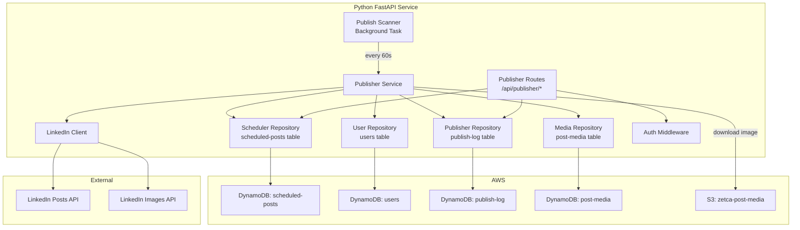
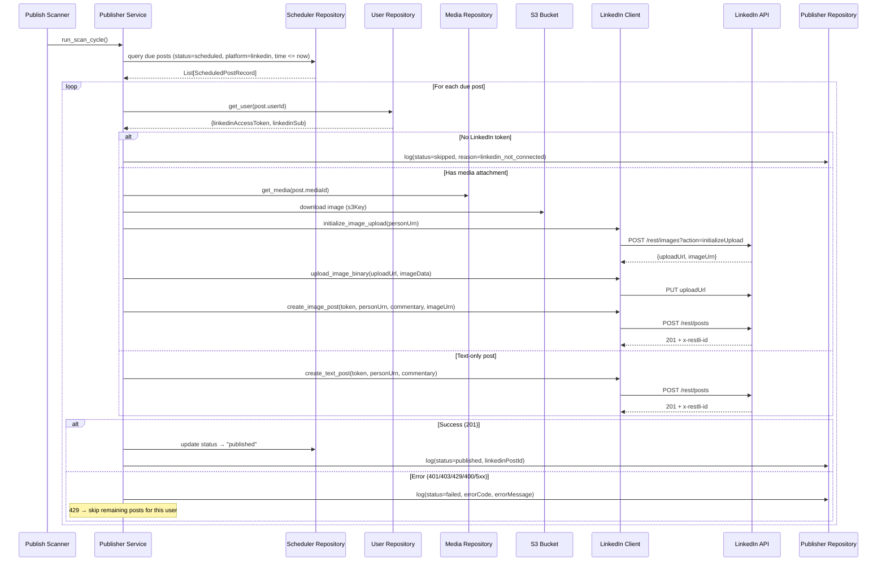
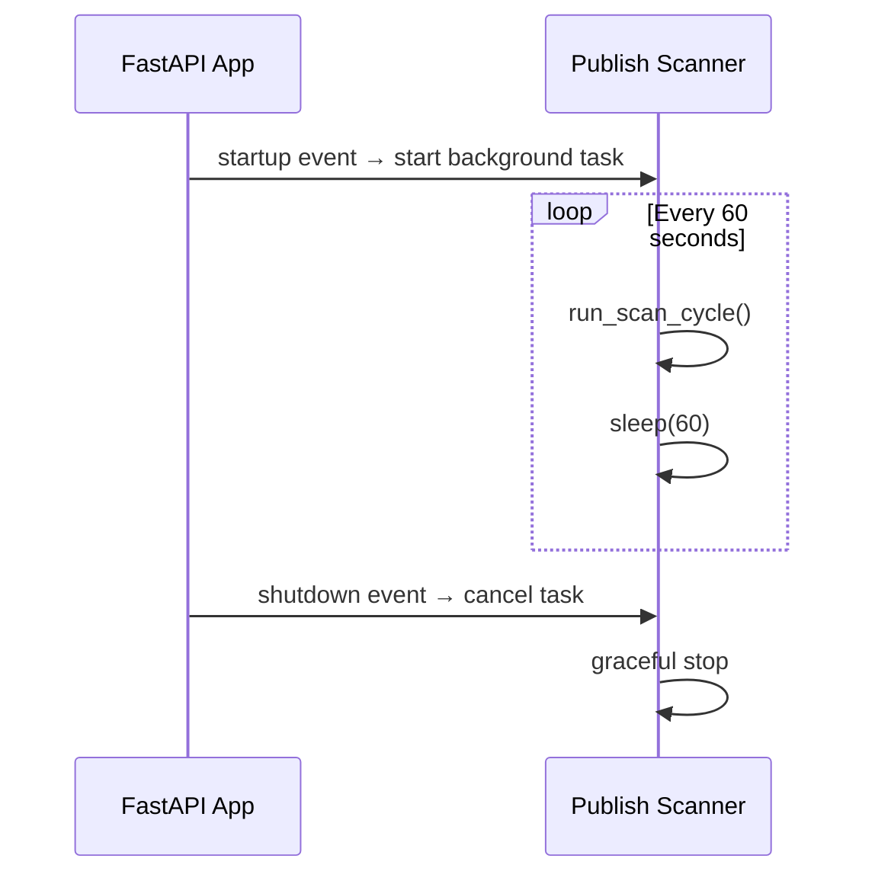

# Design Document: Publisher Agent Backend

## Overview

The Publisher Agent Backend automates the publishing of scheduled social media posts to LinkedIn. It runs as a background process (Publish Scanner) within the existing Python FastAPI service, scanning the `scheduled-posts` DynamoDB table every 60 seconds for posts that are due. For each due post, it retrieves the user's LinkedIn credentials from the `users` table, constructs the appropriate LinkedIn API request, and publishes the post.

The system handles two post types: text-only and image posts. Image posts require a three-step flow — download from S3, upload to LinkedIn via the Images API, then create the post with the image URN. All publish attempts are logged to a dedicated `publish-log` DynamoDB table for auditing and debugging.

Key design decisions:
- **Background asyncio task**: The Publish Scanner runs as an asyncio background task started on FastAPI startup, not as a separate process or cron job. This keeps deployment simple within the existing Docker Compose setup.
- **Sequential per-user processing**: Each scan cycle queries all due posts, groups them by user, and processes sequentially. If a user hits LinkedIn's 429 rate limit, remaining posts for that user are skipped but other users continue.
- **Fresh credentials per cycle**: LinkedIn access tokens are fetched from DynamoDB for each publish cycle — never cached — ensuring token revocations take effect immediately.
- **No retry queue**: Failed posts remain in "scheduled" status and are picked up by the next scan cycle. The publish log tracks each attempt.
- **Concurrency guard**: A processing flag prevents overlapping scan cycles from double-publishing the same post.
- **Dedicated LinkedIn client module**: All LinkedIn API interactions (versioning headers, post creation, image upload) are encapsulated in `python/services/linkedin_client.py`.

## Architecture

### System Components



### Publish Scan Cycle Flow



### Background Task Lifecycle



## Components and Interfaces

### 1. Pydantic Models (`python/models/publisher.py`)

```python
from datetime import datetime, UTC
from typing import Optional, List
from uuid import uuid4
from pydantic import BaseModel, Field, field_validator


class PublishLogRecord(BaseModel):
    """A single publish attempt log entry."""
    log_id: str = Field(default_factory=lambda: str(uuid4()))
    post_id: str
    user_id: str
    platform: str = "linkedin"
    status: str  # "published", "failed", "skipped"
    linkedin_post_id: Optional[str] = None
    error_code: Optional[str] = None
    error_message: Optional[str] = None
    attempted_at: datetime = Field(default_factory=lambda: datetime.now(UTC))

    @field_validator('status')
    @classmethod
    def validate_status(cls, v: str) -> str:
        allowed = {'published', 'failed', 'skipped'}
        if v not in allowed:
            raise ValueError(f'status must be one of: {", ".join(allowed)}')
        return v


class LinkedInPostRequest(BaseModel):
    """Request body for LinkedIn Posts API."""
    author: str  # urn:li:person:{linkedinSub}
    commentary: str
    visibility: str = "PUBLIC"
    distribution: dict = Field(default_factory=lambda: {
        "feedDistribution": "MAIN_FEED",
        "targetEntities": [],
        "thirdPartyDistributionChannels": []
    })
    lifecycle_state: str = "PUBLISHED"
    is_reshare_disabled_by_author: bool = False
    content: Optional[dict] = None  # For image posts: {"media": {"id": "urn:li:image:..."}}


class LinkedInPostResponse(BaseModel):
    """Parsed response from LinkedIn Posts API."""
    status_code: int
    post_id: Optional[str] = None  # From x-restli-id header
    error_code: Optional[str] = None
    error_message: Optional[str] = None


class LinkedInImageUploadResponse(BaseModel):
    """Parsed response from LinkedIn image upload initialization."""
    upload_url: str
    image_urn: str
```

### 2. LinkedIn Client (`python/services/linkedin_client.py`)

```python
import httpx
import logging
from typing import Optional
from models.publisher import LinkedInPostResponse, LinkedInImageUploadResponse

logger = logging.getLogger(__name__)

LINKEDIN_API_BASE = "https://api.linkedin.com/rest"
LINKEDIN_VERSION = "202603"
RESTLI_PROTOCOL_VERSION = "2.0.0"


class LinkedInClient:
    """Encapsulates all LinkedIn REST API interactions."""

    def __init__(self, timeout_seconds: int = 30):
        self.timeout = timeout_seconds

    def _headers(self, access_token: str) -> dict:
        """Standard headers for all LinkedIn API requests."""
        return {
            "Authorization": f"Bearer {access_token}",
            "Linkedin-Version": LINKEDIN_VERSION,
            "X-Restli-Protocol-Version": RESTLI_PROTOCOL_VERSION,
            "Content-Type": "application/json",
        }

    def format_commentary(self, content: str, hashtags: list[str]) -> str:
        """
        Combine post content with hashtags into commentary text.
        Prefixes each hashtag with '#' if not already prefixed.
        Returns content unchanged if hashtags list is empty.
        """

    async def create_text_post(
        self, access_token: str, person_urn: str, commentary: str
    ) -> LinkedInPostResponse:
        """
        POST https://api.linkedin.com/rest/posts
        Creates a text-only post. Returns structured response with status code
        and post ID (from x-restli-id header) on success.
        """

    async def initialize_image_upload(
        self, access_token: str, person_urn: str
    ) -> LinkedInImageUploadResponse:
        """
        POST https://api.linkedin.com/rest/images?action=initializeUpload
        Returns upload URL and image URN.
        """

    async def upload_image_binary(
        self, upload_url: str, image_data: bytes, content_type: str
    ) -> int:
        """
        PUT to the upload URL with raw image bytes.
        Returns HTTP status code.
        """

    async def create_image_post(
        self, access_token: str, person_urn: str, commentary: str, image_urn: str
    ) -> LinkedInPostResponse:
        """
        POST https://api.linkedin.com/rest/posts
        Creates a post with an image attachment. Same as text post but includes
        content.media.id field with the image URN.
        """
```

### 3. User Repository (`python/repositories/user_repository.py`)

```python
import boto3
from typing import Optional
from config import settings


class UserRepository:
    """Read-only repository for accessing user records from the users DynamoDB table."""

    def __init__(self, table_name: str = None, region: str = None):
        self.table_name = table_name or settings.dynamodb_users_table
        self.region = region or settings.aws_region
        session = boto3.Session(profile_name='default', region_name=self.region)
        dynamodb = session.resource('dynamodb')
        self.table = dynamodb.Table(self.table_name)

    async def get_user_linkedin_credentials(self, user_id: str) -> Optional[dict]:
        """
        Retrieve LinkedIn credentials for a user.
        
        Returns dict with keys: linkedinAccessToken, linkedinSub, linkedinName
        Returns None if user not found.
        """
        response = self.table.get_item(Key={'userId': user_id})
        if 'Item' not in response:
            return None
        item = response['Item']
        return {
            'linkedinAccessToken': item.get('linkedinAccessToken'),
            'linkedinSub': item.get('linkedinSub'),
            'linkedinName': item.get('linkedinName'),
        }
```

### 4. Media Repository (`python/repositories/media_repository.py`)

```python
import boto3
from typing import Optional
from config import settings


class MediaRepository:
    """Read-only repository for accessing media records from the post-media DynamoDB table."""

    def __init__(self, table_name: str = None, region: str = None):
        self.table_name = table_name or settings.dynamodb_media_table
        self.region = region or settings.aws_region
        session = boto3.Session(profile_name='default', region_name=self.region)
        dynamodb = session.resource('dynamodb')
        self.table = dynamodb.Table(self.table_name)

    async def get_media_by_id(self, media_id: str) -> Optional[dict]:
        """
        Retrieve media record by ID.
        Returns dict with s3Key, contentType, mediaType, etc.
        Returns None if not found.
        """
        response = self.table.get_item(Key={'mediaId': media_id})
        if 'Item' not in response:
            return None
        return response['Item']
```

### 5. Publisher Repository (`python/repositories/publisher_repository.py`)

```python
import boto3
from boto3.dynamodb.conditions import Key
from typing import List, Optional
from datetime import datetime, UTC
from models.publisher import PublishLogRecord
from config import settings


class PublisherRepository:
    """Repository for publish log data access in DynamoDB."""

    def __init__(self, table_name: str = None, region: str = None):
        self.table_name = table_name or settings.dynamodb_publish_log_table
        self.region = region or settings.aws_region
        session = boto3.Session(profile_name='default', region_name=self.region)
        dynamodb = session.resource('dynamodb')
        self.table = dynamodb.Table(self.table_name)

    async def create_log(self, record: PublishLogRecord) -> PublishLogRecord:
        """Store a publish log record."""

    async def list_logs_by_user(self, user_id: str) -> List[PublishLogRecord]:
        """Query UserIdIndex, sorted by attemptedAt descending."""

    async def list_logs_by_post(self, post_id: str) -> List[PublishLogRecord]:
        """Query PostIdIndex for all attempts on a specific post."""

    async def get_post_owner(self, post_id: str) -> Optional[str]:
        """Get the userId for a post from the scheduled-posts table (for access control)."""

    def _record_to_item(self, record: PublishLogRecord) -> dict:
        """Convert PublishLogRecord to DynamoDB item."""

    def _item_to_record(self, item: dict) -> PublishLogRecord:
        """Convert DynamoDB item to PublishLogRecord."""
```

### 6. Publisher Service (`python/services/publisher_service.py`)

```python
import logging
import boto3
from typing import List, Optional, Set
from datetime import datetime, UTC

from models.publisher import PublishLogRecord, LinkedInPostResponse
from services.linkedin_client import LinkedInClient
from repositories.publisher_repository import PublisherRepository
from repositories.scheduler_repository import SchedulerRepository
from repositories.user_repository import UserRepository
from repositories.media_repository import MediaRepository
from config import settings

logger = logging.getLogger(__name__)


class PublisherService:
    """Orchestrates the publishing workflow."""

    def __init__(
        self,
        linkedin_client: LinkedInClient,
        publisher_repository: PublisherRepository,
        scheduler_repository: SchedulerRepository,
        user_repository: UserRepository,
        media_repository: MediaRepository,
        s3_bucket: str = None,
    ):
        self.linkedin_client = linkedin_client
        self.publisher_repository = publisher_repository
        self.scheduler_repository = scheduler_repository
        self.user_repository = user_repository
        self.media_repository = media_repository
        self.s3_bucket = s3_bucket or settings.s3_media_bucket
        session = boto3.Session(profile_name='default', region_name=settings.aws_region)
        self.s3_client = session.client('s3')

    async def get_due_posts(self) -> list:
        """
        Query scheduled-posts table for posts where:
        - status = "scheduled"
        - platform = "linkedin"
        - scheduledDate + scheduledTime <= now (UTC)
        
        Uses a table scan with filter expression since we need to check
        across all users. Groups results by userId for sequential processing.
        """

    async def publish_post(self, post, user_credentials: dict) -> PublishLogRecord:
        """
        Publish a single post to LinkedIn.
        
        1. Format commentary (content + hashtags)
        2. If post has mediaId → download from S3, upload to LinkedIn, create image post
        3. Else → create text-only post
        4. On success → update post status to "published", create success log
        5. On failure → create failure log, leave post status unchanged
        """

    async def run_scan_cycle(self, processing_post_ids: Set[str]) -> None:
        """
        Execute one full scan cycle:
        
        1. Query due posts
        2. Filter out posts already being processed (concurrency guard)
        3. Group by userId
        4. For each user:
           a. Fetch LinkedIn credentials
           b. If no credentials → skip all user's posts with "skipped" log
           c. Process each post sequentially
           d. On 429 → skip remaining posts for this user
        5. Remove processed post IDs from the processing set
        """

    async def _download_from_s3(self, s3_key: str) -> Optional[bytes]:
        """Download file from S3. Returns bytes or None on failure."""

    async def _publish_text_post(
        self, access_token: str, person_urn: str, commentary: str
    ) -> LinkedInPostResponse:
        """Create a text-only LinkedIn post."""

    async def _publish_image_post(
        self, access_token: str, person_urn: str, commentary: str,
        image_data: bytes, content_type: str
    ) -> LinkedInPostResponse:
        """Upload image to LinkedIn then create post with image URN."""
```

### 7. Publish Scanner (`python/services/publish_scanner.py`)

```python
import asyncio
import logging
from typing import Set

from services.publisher_service import PublisherService
from config import settings

logger = logging.getLogger(__name__)


class PublishScanner:
    """Background task that periodically scans for and publishes due posts."""

    def __init__(self, publisher_service: PublisherService):
        self.publisher_service = publisher_service
        self.interval = settings.publisher_scan_interval_seconds
        self._running = False
        self._task: asyncio.Task = None
        self._processing_post_ids: Set[str] = set()

    async def start(self):
        """Start the background scan loop."""
        self._running = True
        self._task = asyncio.create_task(self._run_loop())
        logger.info(f"Publish Scanner started (interval: {self.interval}s)")

    async def stop(self):
        """Gracefully stop the scanner."""
        self._running = False
        if self._task:
            self._task.cancel()
            try:
                await self._task
            except asyncio.CancelledError:
                pass
        logger.info("Publish Scanner stopped")

    async def _run_loop(self):
        """Main loop: scan → sleep → repeat."""
        while self._running:
            try:
                await self.publisher_service.run_scan_cycle(self._processing_post_ids)
            except Exception as e:
                logger.error(f"Scan cycle failed: {e}", exc_info=True)
            await asyncio.sleep(self.interval)
```

### 8. Publisher Routes (`python/routes/publisher.py`)

```python
from fastapi import APIRouter, HTTPException, status, Depends
from typing import List
from models.publisher import PublishLogRecord
from repositories.publisher_repository import PublisherRepository
from repositories.scheduler_repository import SchedulerRepository
from middleware.auth import auth_middleware
from config import settings
import logging

logger = logging.getLogger(__name__)
router = APIRouter(prefix="/api/publisher", tags=["publisher"])

# Initialize repositories
publisher_repository = PublisherRepository(
    table_name=settings.dynamodb_publish_log_table,
    region=settings.aws_region,
)
scheduler_repository = SchedulerRepository(
    table_name=settings.dynamodb_scheduled_posts_table,
    region=settings.aws_region,
)


@router.get("/logs", response_model=List[PublishLogRecord])
async def list_logs(user_id: str = Depends(auth_middleware.get_current_user)):
    """
    List all publish log records for the authenticated user,
    ordered by attemptedAt descending.
    """

@router.get("/logs/{post_id}", response_model=List[PublishLogRecord])
async def list_logs_by_post(
    post_id: str,
    user_id: str = Depends(auth_middleware.get_current_user),
):
    """
    List all publish log records for a specific post.
    Returns 403 if the post belongs to a different user.
    """

@router.post("/publish/{post_id}", response_model=PublishLogRecord)
async def publish_post(
    post_id: str,
    user_id: str = Depends(auth_middleware.get_current_user),
):
    """
    Immediately publish a specific post to LinkedIn (on-demand manual publish).
    
    1. Verify post exists and belongs to authenticated user (404/403)
    2. Verify post platform is "linkedin" (400 if not)
    3. Verify post is not already published (400 if already published)
    4. Fetch user LinkedIn credentials
    5. Publish via LinkedInClient (same flow as background scanner)
    6. Update post status to "published" on success
    7. Create PublishLogRecord and return it
    """
```

### 9. Frontend: Publisher API Client (`lib/api/publisherClient.ts`)

```typescript
import { ScheduledPost } from '@/types/scheduler';

const API_BASE_URL = process.env.NEXT_PUBLIC_PYTHON_SERVICE_URL || 'http://localhost:8000';

export class PublisherAPIError extends Error {
  constructor(message: string, public statusCode?: number, public details?: unknown) {
    super(message);
    this.name = 'PublisherAPIError';
  }
}

// Uses same getAuthToken, createAuthHeaders, handleAuthError patterns as schedulerClient.ts

export interface PublishLogRecord {
  logId: string;
  postId: string;
  userId: string;
  platform: string;
  status: 'published' | 'failed' | 'skipped';
  linkedinPostId?: string;
  errorCode?: string;
  errorMessage?: string;
  attemptedAt: string;
}

export async function publishPost(postId: string): Promise<PublishLogRecord> {
  // POST /api/publisher/publish/{postId}
}

export async function listLogs(): Promise<PublishLogRecord[]> {
  // GET /api/publisher/logs
}

export async function listLogsByPost(postId: string): Promise<PublishLogRecord[]> {
  // GET /api/publisher/logs/{postId}
}
```

### 10. Frontend: PostsTable Integration

The existing `PostsTable` component (`components/dashboard/PostsTable.tsx`) needs these changes:

- Replace `mockPostsData` import with `schedulerClient.listPosts()` API call on mount
- Replace local `handlePublish` with `publisherClient.publishPost(postId)` API call
- Add loading state on the Publish button during API call
- Show error toast/message if publish fails
- Refresh post list after successful publish to reflect updated status
- The "Publish" button appears for both "scheduled" and "draft" posts with platform "linkedin"

### 11. Configuration Updates (`python/config.py`)

Add to existing `Settings` class:

```python
# Publisher Configuration
dynamodb_publish_log_table: str = "publish-log-dev"
publisher_scan_interval_seconds: int = 60
linkedin_api_timeout_seconds: int = 30
publisher_enabled: bool = True
s3_media_bucket: str = "zetca-post-media-dev"
dynamodb_media_table: str = "post-media-dev"
```

### 10. Main App Registration (`python/main.py`)

```python
from routes.publisher import router as publisher_router
from services.publish_scanner import PublishScanner
from services.publisher_service import PublisherService
from services.linkedin_client import LinkedInClient
# ... repository imports ...

app.include_router(publisher_router)

# Publisher background task
publish_scanner: PublishScanner = None

@app.on_event("startup")
async def startup_publisher():
    global publish_scanner
    if settings.publisher_enabled:
        linkedin_client = LinkedInClient(timeout_seconds=settings.linkedin_api_timeout_seconds)
        publisher_service = PublisherService(
            linkedin_client=linkedin_client,
            publisher_repository=PublisherRepository(),
            scheduler_repository=SchedulerRepository(),
            user_repository=UserRepository(),
            media_repository=MediaRepository(),
        )
        publish_scanner = PublishScanner(publisher_service)
        await publish_scanner.start()

@app.on_event("shutdown")
async def shutdown_publisher():
    if publish_scanner:
        await publish_scanner.stop()
```

### 11. Terraform: Publish Log Table (`terraform/publish-log-table.tf`)

```hcl
resource "aws_dynamodb_table" "publish_log" {
  name           = "publish-log-${var.environment}"
  billing_mode   = "PAY_PER_REQUEST"
  hash_key       = "logId"

  attribute {
    name = "logId"
    type = "S"
  }

  attribute {
    name = "postId"
    type = "S"
  }

  attribute {
    name = "userId"
    type = "S"
  }

  attribute {
    name = "attemptedAt"
    type = "S"
  }

  global_secondary_index {
    name            = "PostIdIndex"
    hash_key        = "postId"
    projection_type = "ALL"
  }

  global_secondary_index {
    name            = "UserIdIndex"
    hash_key        = "userId"
    range_key       = "attemptedAt"
    projection_type = "ALL"
  }

  point_in_time_recovery {
    enabled = true
  }

  server_side_encryption {
    enabled = true
  }

  tags = {
    Name        = "Publish Log Table"
    Environment = var.environment
    ManagedBy   = "Terraform"
    Application = "PublisherAgent"
  }
}
```


## Data Models

### DynamoDB Table: publish-log

**Table Structure:**
- **Primary Key**: `logId` (String) — Partition key
- **GSI: PostIdIndex**: hash_key=`postId`
- **GSI: UserIdIndex**: hash_key=`userId`, range_key=`attemptedAt`

**Item Schema:**
```json
{
  "logId": "uuid-v4-string",
  "postId": "uuid-v4-string",
  "userId": "uuid-v4-string",
  "platform": "linkedin",
  "status": "published|failed|skipped",
  "linkedinPostId": "urn:li:share:12345",
  "errorCode": "rate_limited",
  "errorMessage": "Too many requests",
  "attemptedAt": "2025-07-15T14:30:00+00:00"
}
```

### Existing Table References

**scheduled-posts table** (read + update by Publisher):
- Query: status="scheduled", platform="linkedin", scheduledDate+scheduledTime <= now
- Update: status → "published" on success

**users table** (read-only by Publisher):
- Lookup by userId → retrieve `linkedinAccessToken`, `linkedinSub`, `linkedinName`

**post-media table** (read-only by Publisher):
- Lookup by mediaId → retrieve `s3Key`, `contentType`

### LinkedIn API Request/Response Shapes

**Text-Only Post Request:**
```json
{
  "author": "urn:li:person:{linkedinSub}",
  "commentary": "Post content #hashtag1 #hashtag2",
  "visibility": "PUBLIC",
  "distribution": {
    "feedDistribution": "MAIN_FEED",
    "targetEntities": [],
    "thirdPartyDistributionChannels": []
  },
  "lifecycleState": "PUBLISHED",
  "isReshareDisabledByAuthor": false
}
```

**Image Post Request** (adds `content` field):
```json
{
  "author": "urn:li:person:{linkedinSub}",
  "commentary": "Post content #hashtag1 #hashtag2",
  "visibility": "PUBLIC",
  "distribution": {
    "feedDistribution": "MAIN_FEED",
    "targetEntities": [],
    "thirdPartyDistributionChannels": []
  },
  "lifecycleState": "PUBLISHED",
  "isReshareDisabledByAuthor": false,
  "content": {
    "media": {
      "id": "urn:li:image:{imageId}"
    }
  }
}
```

**Image Upload Initialization Request:**
```json
{
  "initializeUploadRequest": {
    "owner": "urn:li:person:{linkedinSub}"
  }
}
```

**Image Upload Initialization Response:**
```json
{
  "value": {
    "uploadUrlExpiresAt": 1234567890,
    "uploadUrl": "https://www.linkedin.com/dms-uploads/...",
    "image": "urn:li:image:C4E10AQFoyyAjHPMQuQ"
  }
}
```

**Required Headers (all LinkedIn API calls):**
```
Authorization: Bearer {linkedinAccessToken}
Linkedin-Version: 202603
X-Restli-Protocol-Version: 2.0.0
Content-Type: application/json
```

### Error Code Mapping

| LinkedIn HTTP Status | LinkedIn Error | Publish Log `errorCode` | Publish Log `status` | Action |
|---|---|---|---|---|
| 201 | — | — | published | Update post → "published" |
| 400 | INVALID_URN_TYPE, MISSING_FIELD, etc. | `validation_error` | failed | Skip post |
| 401 | EMPTY_ACCESS_TOKEN | `token_expired` | failed | Skip post |
| 403 | ACCESS_DENIED | `access_denied` | failed | Skip post |
| 429 | TOO_MANY_REQUESTS | `rate_limited` | failed | Skip remaining user posts |
| 500/503 | Server error | `linkedin_server_error` | failed | Skip post (retry next cycle) |
| Network error | — | `network_error` | failed | Skip post (retry next cycle) |
| — | No LinkedIn token | `linkedin_not_connected` | skipped | Skip post |
| — | No linkedinSub | `linkedin_sub_missing` | skipped | Skip post |
| — | S3 download failed | `s3_download_error` | failed | Skip post |
| — | Image upload init failed | `image_upload_init_error` | failed | Skip post |
| — | Image binary upload failed | `image_upload_error` | failed | Skip post |
| — | Media record not found | — | — | Publish as text-only |


## Correctness Properties

*A property is a characteristic or behavior that should hold true across all valid executions of a system — essentially, a formal statement about what the system should do. Properties serve as the bridge between human-readable specifications and machine-verifiable correctness guarantees.*

### Property 1: Due Post Filter Correctness

*For any* set of scheduled posts with varying statuses ("draft", "scheduled", "published"), platforms ("linkedin", "instagram", "x"), and scheduledDate+scheduledTime combinations, the due post filter should return exactly those posts where status equals "scheduled", platform equals "linkedin", and the combined scheduledDate+scheduledTime is at or before the current UTC time. Posts not matching all three criteria should be excluded.

**Validates: Requirements 1.1**

### Property 2: Fault Isolation Across Posts

*For any* list of due posts where some posts will succeed and some will fail (due to API errors, missing credentials, etc.), the number of successfully published posts should equal the number of posts that would succeed independently. A failure on post N should not prevent post N+1 from being attempted (unless both belong to the same user and post N triggered a 429).

**Validates: Requirements 1.3**

### Property 3: Concurrency Guard Skips In-Progress Posts

*For any* set of due posts and any subset of post IDs marked as currently processing, the scan cycle should only attempt to publish posts whose IDs are not in the processing set. The set of attempted post IDs and the processing set should be disjoint.

**Validates: Requirements 1.5**

### Property 4: Commentary Formatting with Hashtags

*For any* content string and list of hashtag strings, `format_commentary(content, hashtags)` should: (a) return the content unchanged when hashtags is empty, (b) return content followed by a space and space-separated hashtags when hashtags is non-empty, and (c) prefix each hashtag with "#" if it doesn't already start with "#", without double-prefixing hashtags that already have "#".

**Validates: Requirements 12.1, 12.2, 12.3, 2.3, 9.8**

### Property 5: LinkedIn Request Headers and Author URN

*For any* access token string and linkedinSub string, the constructed LinkedIn API request should include headers `Authorization: Bearer {access_token}`, `Linkedin-Version: 202603`, `X-Restli-Protocol-Version: 2.0.0`, `Content-Type: application/json`, and the request body `author` field should equal `urn:li:person:{linkedinSub}`.

**Validates: Requirements 2.2, 2.5, 9.6, 9.7**

### Property 6: Text vs Image Post Routing

*For any* due post, if `mediaId` is null the publisher should use the text-only post creation path, and if `mediaId` is not null with `mediaType` "image" the publisher should use the image post creation path (which includes the `content.media.id` field with the image URN). Both paths should produce requests with identical base fields (author, commentary, visibility, distribution, lifecycleState).

**Validates: Requirements 2.1, 3.1, 3.4, 3.5**

### Property 7: LinkedIn Error Code Mapping

*For any* LinkedIn API error response with status code in {400, 401, 403, 500, 503} or a network error, the resulting PublishLogRecord should have status "failed" and the errorCode should map correctly: 401 → "token_expired", 403 → "access_denied", 400 → "validation_error", 500/503 → "linkedin_server_error", network error → "network_error". The post status should remain "scheduled" (not updated).

**Validates: Requirements 5.1, 5.2, 5.4, 5.5, 5.6**

### Property 8: Rate Limit Skips Remaining User Posts

*For any* user with multiple due posts, if LinkedIn returns a 429 error on post N, all subsequent posts for that user (posts N+1, N+2, ...) should be skipped without attempting LinkedIn API calls. Posts for other users should continue to be processed normally.

**Validates: Requirements 5.3**

### Property 9: Missing Credentials Produces Skipped Log

*For any* user record where `linkedinAccessToken` is missing or null, all due posts for that user should produce PublishLogRecords with status "skipped" and errorCode "linkedin_not_connected". Similarly, if `linkedinSub` is missing, the errorCode should be "linkedin_sub_missing". No LinkedIn API calls should be made for these posts.

**Validates: Requirements 4.2, 4.3**

### Property 10: Successful Publish Transitions Status and Creates Log

*For any* post that receives a 201 response from LinkedIn, the post's status in the scheduled-posts table should be updated to "published", and a PublishLogRecord should be created with status "published" and the `linkedinPostId` extracted from the `x-restli-id` response header.

**Validates: Requirements 2.6, 2.7, 6.3**

### Property 11: Publish Log Record Completeness and Validation

*For any* publish attempt (success, failure, or skip), the resulting PublishLogRecord should contain all required fields: `log_id` (non-empty), `post_id`, `user_id`, `platform`, `status`, and `attempted_at`. The `status` field should accept only "published", "failed", or "skipped" — any other value should be rejected by validation.

**Validates: Requirements 6.2, 10.5**

### Property 12: User Isolation on Publish Logs

*For any* two distinct user IDs (User A and User B) and any set of PublishLogRecords, querying logs for User A should return only records where userId equals User A. Querying logs for a post owned by User B while authenticated as User A should result in a 403 error.

**Validates: Requirements 7.1, 7.3, 11.1, 11.2**

## Error Handling

### LinkedIn API Errors

| Error | Action | Post Status | Log Status |
|---|---|---|---|
| 201 Created | Extract post ID, update status | → "published" | "published" |
| 400 Bad Request | Log error details, skip post | unchanged | "failed" |
| 401 Unauthorized | Log error, skip post | unchanged | "failed" |
| 403 Forbidden | Log error, skip post | unchanged | "failed" |
| 429 Rate Limited | Log error, skip remaining user posts | unchanged | "failed" |
| 500/503 Server Error | Log error, skip post (retry next cycle) | unchanged | "failed" |
| Network/Timeout | Log error, skip post (retry next cycle) | unchanged | "failed" |

### S3/Media Errors

| Error | Action |
|---|---|
| Media record not found for mediaId | Log warning, publish as text-only |
| S3 download fails | Log error, skip post (status unchanged) |
| LinkedIn image upload init fails | Log error, skip post (status unchanged) |
| LinkedIn image binary upload fails | Log error, skip post (status unchanged) |

### Credential Errors

| Error | Action | Log Status |
|---|---|---|
| User not found | Skip all user's posts | "skipped" |
| No linkedinAccessToken | Skip all user's posts | "skipped" (reason: linkedin_not_connected) |
| No linkedinSub | Skip all user's posts | "skipped" (reason: linkedin_sub_missing) |

### Scanner Resilience

- Unhandled exceptions in a scan cycle are caught, logged, and the scanner continues to the next cycle
- The scanner never crashes the FastAPI application
- If `publisher_enabled` is false, the scanner does not start

### API Endpoint Errors

| Endpoint | Error | Status Code |
|---|---|---|
| GET /api/publisher/logs | No JWT token | 401 |
| GET /api/publisher/logs/{postId} | Post belongs to other user | 403 |
| GET /api/publisher/logs/{postId} | Post not found | 404 |
| Any publisher endpoint | Internal error | 500 |

## Testing Strategy

### Unit Tests

Unit tests cover specific examples, edge cases, and integration points:

- **Configuration defaults**: Verify `dynamodb_publish_log_table` defaults to "publish-log-dev", `publisher_scan_interval_seconds` to 60, `linkedin_api_timeout_seconds` to 30, `publisher_enabled` to True
- **PublishLogRecord validation**: Verify status accepts only "published"/"failed"/"skipped", rejects other values
- **LinkedIn request body structure**: Verify text-only and image post bodies contain required fields with correct values
- **Commentary with empty hashtags**: Verify content is returned unchanged
- **Media record not found fallback**: Verify post is published as text-only when media record is missing
- **S3 download failure**: Verify post is skipped and status remains "scheduled"
- **Image upload failure stages**: Verify each failure point (init, binary upload) results in skip
- **Scanner startup/shutdown**: Verify background task starts on app startup and stops on shutdown
- **Publisher enabled flag**: Verify scanner doesn't start when `publisher_enabled` is False
- **API endpoint authentication**: Verify 401 when no JWT is provided
- **API endpoint user isolation**: Verify 403 when accessing another user's post logs

### Property-Based Tests

Property-based tests use `hypothesis` (Python PBT library, already in requirements.txt) with a minimum of 100 iterations per property. Each test references its design document property.

**Test file**: `python/tests/test_publisher_properties.py`

Each property test must be tagged with a comment:
```python
# Feature: publisher-agent-backend, Property {N}: {property title}
```

Properties to implement as PBT:

1. **Due post filter correctness** — Generate random lists of posts with varying statuses, platforms, and times. Verify the filter returns exactly the correct subset.
2. **Fault isolation** — Generate lists of posts with random success/failure outcomes. Verify successful posts are published regardless of other failures.
3. **Concurrency guard** — Generate sets of due post IDs and processing post IDs. Verify the attempted set is disjoint from the processing set.
4. **Commentary formatting** — Generate random content strings and hashtag lists. Verify formatting rules (empty → unchanged, non-empty → appended, "#" prefix normalization).
5. **LinkedIn request headers and author URN** — Generate random access tokens and linkedinSub values. Verify header dict and author URN format.
6. **Text vs image routing** — Generate random posts with and without mediaId. Verify correct path is taken and base fields are consistent.
7. **Error code mapping** — Generate random LinkedIn error status codes. Verify correct errorCode mapping.
8. **Rate limit skips remaining user posts** — Generate lists of posts per user with a 429 at a random position. Verify subsequent posts are skipped.
9. **Missing credentials skipped** — Generate user records with missing LinkedIn fields. Verify correct skip reason.
10. **Successful publish state transition** — Generate successful publish scenarios. Verify post status → "published" and log contains linkedinPostId.
11. **Log record completeness and validation** — Generate random publish outcomes. Verify all required fields present. Generate random strings for status and verify only allowed values pass.
12. **User isolation on logs** — Generate log records for multiple users. Verify query returns only the correct user's records.

### Test Configuration

- Library: `hypothesis` (already in `python/requirements.txt`)
- Minimum iterations: 100 per property (use `@settings(max_examples=100)`)
- Test runner: `pytest` with `pytest-asyncio`
- HTTP client mocking: `httpx` mock or `unittest.mock` for LinkedIn API calls
- DynamoDB mocking: `unittest.mock` for repository calls
- S3 mocking: `unittest.mock` for boto3 S3 client
