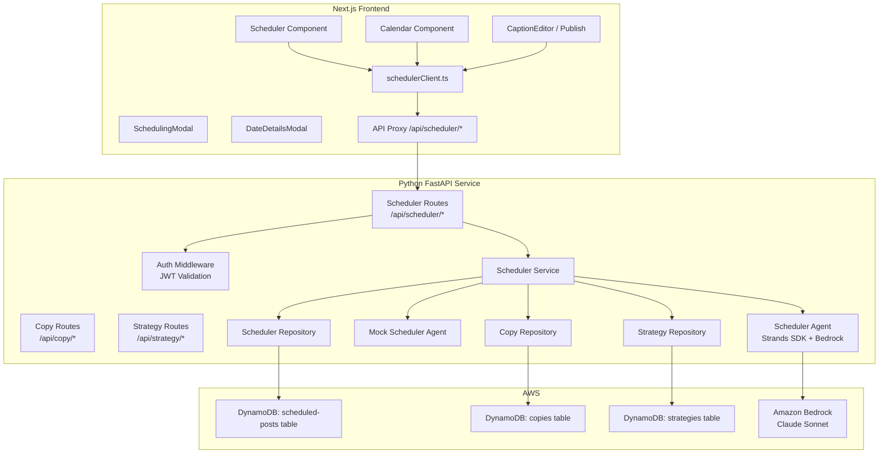
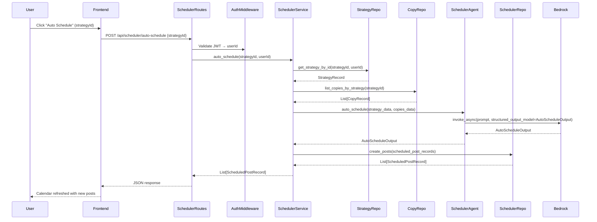
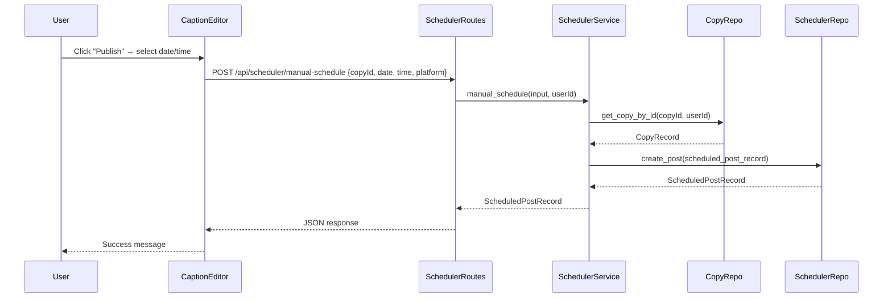
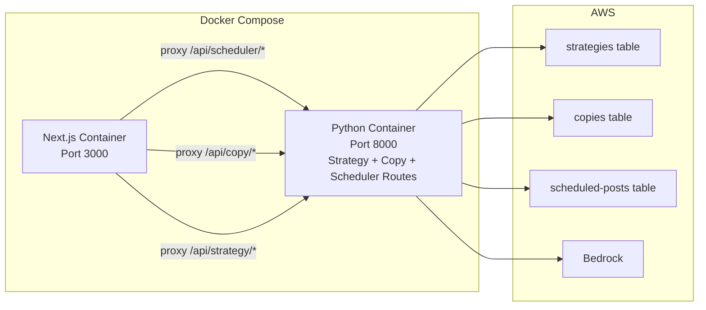

# Design Document: Scheduler Agent Backend

## Overview

The Scheduler Agent Backend extends the existing Python FastAPI service with AI-powered social media post scheduling and integrates the scheduling functionality into the Next.js frontend. The Scheduler Agent consumes strategy data (posting schedule, platform recommendations, content themes) and copy content from the Copywriter Agent, then intelligently distributes posts across a calendar with optimal dates and times.

The architecture follows the same patterns established by the Strategist and Copywriter Agent backends:
- **FastAPI Routes**: New `/api/scheduler/*` endpoints registered alongside existing strategy and copy routes
- **Pydantic Models**: Structured input/output validation for scheduling data
- **DynamoDB Repository**: New `scheduled-posts` table with GSIs for userId, strategyId, and copyId queries
- **Strands Agents SDK**: Scheduler agent with Bedrock for AI-powered auto-scheduling
- **JWT Authentication**: Reuses existing `auth_middleware` for user identity
- **Mock Agent**: Development-friendly mock that returns realistic scheduling assignments

Key design decisions:
- Scheduled posts are linked to both strategies (via `strategyId`) and copies (via `copyId`), enabling full traceability
- The scheduler agent fetches strategy and copy data from their respective repositories to determine optimal scheduling
- Auto-scheduling creates all posts atomically — if the agent fails, no incomplete records are stored
- Manual scheduling bypasses the agent entirely, creating a single post directly via the service layer
- Each post response includes `strategyColor` and `strategyLabel` fields for multi-strategy visual differentiation on the calendar
- The frontend transitions from local React state to API-backed CRUD operations for post management

## Architecture

### System Components



### Auto-Schedule Flow



### Manual Schedule Flow



### Deployment (extends existing Docker Compose)



## Components and Interfaces

### 1. Pydantic Models (`python/models/scheduler.py`)

```python
from datetime import datetime, UTC
from typing import List, Optional
from uuid import uuid4
from pydantic import BaseModel, Field, field_validator, ConfigDict


class AutoScheduleInput(BaseModel):
    """Input model for auto-schedule requests."""
    strategy_id: str = Field(
        ...,
        min_length=1,
        description="ID of the strategy to auto-schedule copies from"
    )

    @field_validator('strategy_id')
    @classmethod
    def validate_non_empty(cls, v: str) -> str:
        if not v or not v.strip():
            raise ValueError('strategy_id cannot be empty or whitespace only')
        return v.strip()


class ManualScheduleInput(BaseModel):
    """Input model for manual scheduling of a single post."""
    copy_id: str = Field(..., min_length=1, description="ID of the copy to schedule")
    scheduled_date: str = Field(..., description="ISO 8601 date string (YYYY-MM-DD)")
    scheduled_time: str = Field(..., description="Time in HH:MM format")
    platform: str = Field(..., min_length=1, description="Target social media platform")

    @field_validator('copy_id', 'platform')
    @classmethod
    def validate_non_empty(cls, v: str) -> str:
        if not v or not v.strip():
            raise ValueError('Field cannot be empty or whitespace only')
        return v.strip()

    @field_validator('scheduled_date')
    @classmethod
    def validate_date_format(cls, v: str) -> str:
        if not v or not v.strip():
            raise ValueError('scheduled_date is required')
        try:
            datetime.strptime(v.strip(), '%Y-%m-%d')
        except ValueError:
            raise ValueError('scheduled_date must be in YYYY-MM-DD format')
        return v.strip()

    @field_validator('scheduled_time')
    @classmethod
    def validate_time_format(cls, v: str) -> str:
        if not v or not v.strip():
            raise ValueError('scheduled_time is required')
        try:
            datetime.strptime(v.strip(), '%H:%M')
        except ValueError:
            raise ValueError('scheduled_time must be in HH:MM format')
        return v.strip()


class PostAssignment(BaseModel):
    """A single post assignment from the Scheduler Agent."""
    copy_id: str = Field(..., description="ID of the copy being scheduled")
    scheduled_date: str = Field(..., description="ISO 8601 date string")
    scheduled_time: str = Field(..., description="Time in HH:MM format")
    platform: str = Field(..., description="Target platform")


class AutoScheduleOutput(BaseModel):
    """Structured output from the Scheduler Agent."""
    posts: List[PostAssignment] = Field(
        ...,
        min_length=1,
        description="List of post assignments with dates, times, and copy references"
    )


class ScheduledPostRecord(BaseModel):
    """Complete scheduled post record for database storage."""
    id: str = Field(
        default_factory=lambda: str(uuid4()),
        description="Unique post identifier"
    )
    strategy_id: str = Field(..., description="Associated strategy ID")
    copy_id: str = Field(..., description="Associated copy ID")
    user_id: str = Field(..., description="Owner user ID from JWT")
    content: str = Field(..., description="Post text content")
    platform: str = Field(..., description="Target platform")
    hashtags: List[str] = Field(
        default_factory=list,
        description="Relevant hashtags"
    )
    scheduled_date: str = Field(..., description="ISO 8601 date string")
    scheduled_time: str = Field(..., description="Time in HH:MM format")
    status: str = Field(
        default="draft",
        description="Post status: draft, scheduled, or published"
    )
    strategy_color: str = Field(
        default="",
        description="Color assigned to the strategy for visual differentiation"
    )
    strategy_label: str = Field(
        default="",
        description="Strategy brand name for display"
    )
    created_at: datetime = Field(
        default_factory=lambda: datetime.now(UTC),
        description="Creation timestamp"
    )
    updated_at: datetime = Field(
        default_factory=lambda: datetime.now(UTC),
        description="Last modification timestamp"
    )

    @field_validator('status')
    @classmethod
    def validate_status(cls, v: str) -> str:
        allowed = {'draft', 'scheduled', 'published'}
        if v not in allowed:
            raise ValueError(f'status must be one of: {", ".join(allowed)}')
        return v

    model_config = ConfigDict(ser_json_timedelta='iso8601')


class ScheduledPostUpdate(BaseModel):
    """Input model for updating a scheduled post."""
    scheduled_date: Optional[str] = None
    scheduled_time: Optional[str] = None
    content: Optional[str] = None
    platform: Optional[str] = None
    hashtags: Optional[List[str]] = None
    status: Optional[str] = None

    @field_validator('status')
    @classmethod
    def validate_status(cls, v: Optional[str]) -> Optional[str]:
        if v is not None:
            allowed = {'draft', 'scheduled', 'published'}
            if v not in allowed:
                raise ValueError(f'status must be one of: {", ".join(allowed)}')
        return v

    @field_validator('scheduled_date')
    @classmethod
    def validate_date_format(cls, v: Optional[str]) -> Optional[str]:
        if v is not None:
            try:
                datetime.strptime(v.strip(), '%Y-%m-%d')
            except ValueError:
                raise ValueError('scheduled_date must be in YYYY-MM-DD format')
        return v

    @field_validator('scheduled_time')
    @classmethod
    def validate_time_format(cls, v: Optional[str]) -> Optional[str]:
        if v is not None:
            try:
                datetime.strptime(v.strip(), '%H:%M')
            except ValueError:
                raise ValueError('scheduled_time must be in HH:MM format')
        return v
```


### 2. Scheduler Repository (`python/repositories/scheduler_repository.py`)

```python
class SchedulerRepository:
    """Repository for scheduled post data access in DynamoDB."""

    def __init__(self, table_name: str = None, region: str = None):
        self.table_name = table_name or settings.dynamodb_scheduled_posts_table
        self.region = region or settings.aws_region
        session = boto3.Session(profile_name='default', region_name=self.region)
        dynamodb = session.resource('dynamodb')
        self.table = dynamodb.Table(self.table_name)

    async def create_post(self, record: ScheduledPostRecord) -> ScheduledPostRecord:
        """Store a single scheduled post record."""

    async def create_posts(self, records: List[ScheduledPostRecord]) -> List[ScheduledPostRecord]:
        """Batch store multiple scheduled post records."""

    async def get_post_by_id(self, post_id: str, user_id: str = None) -> Optional[ScheduledPostRecord]:
        """Retrieve a post by ID with optional user isolation."""

    async def post_exists(self, post_id: str) -> bool:
        """Check if a post exists regardless of owner."""

    async def list_posts_by_user(self, user_id: str) -> List[ScheduledPostRecord]:
        """List all posts for a user via UserIdIndex, sorted by scheduledDate ascending."""

    async def list_posts_by_strategy(self, strategy_id: str) -> List[ScheduledPostRecord]:
        """List all posts for a strategy via StrategyIdIndex, sorted by scheduledDate ascending."""

    async def update_post(self, post_id: str, updates: dict) -> ScheduledPostRecord:
        """Update post fields and set updatedAt. Returns updated record."""

    async def delete_post(self, post_id: str) -> bool:
        """Delete a post record. Returns True if deleted."""

    def _record_to_item(self, record: ScheduledPostRecord) -> dict:
        """Convert ScheduledPostRecord to DynamoDB item."""

    def _item_to_record(self, item: dict) -> ScheduledPostRecord:
        """Convert DynamoDB item to ScheduledPostRecord."""
```

### 3. Scheduler Agent (`python/services/scheduler_agent.py`)

```python
class SchedulerAgent:
    """Production Scheduler Agent using Strands SDK with Bedrock."""

    def __init__(self, aws_region: str, model_id: str, aws_access_key_id=None, aws_secret_access_key=None):
        # Same Bedrock initialization pattern as CopywriterAgent
        self.agent = Agent(
            model=self.model,
            system_prompt=self._get_system_prompt()
        )

    def _get_system_prompt(self) -> str:
        """System prompt instructing the agent to act as a social media scheduling optimizer."""

    async def auto_schedule(self, strategy_data: dict, copies_data: List[dict]) -> AutoScheduleOutput:
        """
        Analyze strategy posting schedule and copies to determine optimal scheduling.
        
        The agent considers:
        - posting_schedule from the strategy (frequency, timing)
        - platform_recommendations (which platforms, priority)
        - content_themes for thematic distribution
        - Avoids duplicate posts on the same platform at the same date/time
        
        Returns AutoScheduleOutput with post assignments.
        """
        result = await self.agent.invoke_async(prompt, structured_output_model=AutoScheduleOutput)
        if result.structured_output is None:
            raise StructuredOutputException("Scheduler agent failed to return structured output")
        return result.structured_output
```

### 4. Mock Scheduler Agent (`python/services/mock_scheduler_agent.py`)

```python
class MockSchedulerAgent:
    """Mock implementation for development without AWS."""

    async def auto_schedule(self, strategy_data: dict, copies_data: List[dict]) -> AutoScheduleOutput:
        """
        Return realistic scheduling assignments with dates spread across upcoming weeks.
        
        Simulates a processing delay. Generates assignments that reference the provided
        copies and strategy data, distributing them across the next 2-4 weeks with
        varied times and no duplicate platform+date+time combinations.
        """
        await asyncio.sleep(2)
        # Generate PostAssignment for each copy, spread across upcoming dates
        # ...
        return AutoScheduleOutput(posts=assignments)
```

### 5. Scheduler Service (`python/services/scheduler_service.py`)

```python
class SchedulerService:
    """Business logic for scheduling operations."""

    def __init__(self, agent, scheduler_repository, copy_repository, strategy_repository):
        self.agent = agent
        self.scheduler_repository = scheduler_repository
        self.copy_repository = copy_repository
        self.strategy_repository = strategy_repository

    # Strategy color palette for visual differentiation
    STRATEGY_COLORS = [
        "#3B82F6", "#EF4444", "#10B981", "#F59E0B",
        "#8B5CF6", "#EC4899", "#06B6D4", "#F97316",
    ]

    def _get_strategy_color(self, strategy_id: str) -> str:
        """Derive a consistent color from strategyId hash."""
        return self.STRATEGY_COLORS[hash(strategy_id) % len(self.STRATEGY_COLORS)]

    async def auto_schedule(self, strategy_id: str, user_id: str) -> List[ScheduledPostRecord]:
        """
        Auto-schedule all copies for a strategy using the AI agent.
        
        1. Fetch strategy (verify ownership → 404/403)
        2. Fetch copies for strategy (400 if none)
        3. Call agent.auto_schedule() with strategy + copies data
        4. Create ScheduledPostRecord for each assignment with status "scheduled"
        5. Batch store all records
        
        If the agent fails, no records are stored.
        """

    async def manual_schedule(self, input: ManualScheduleInput, user_id: str) -> ScheduledPostRecord:
        """
        Manually schedule a single copy.
        
        1. Fetch copy (verify ownership → 404/403)
        2. Fetch associated strategy for color/label
        3. Create ScheduledPostRecord with status "scheduled"
        4. Store record
        """

    async def create_post(self, post_data: dict, user_id: str) -> ScheduledPostRecord:
        """Create a new post with status 'draft'."""

    async def get_post(self, post_id: str, user_id: str) -> tuple[Optional[ScheduledPostRecord], bool]:
        """Get a post by ID with user isolation. Returns (record, belongs_to_other)."""

    async def list_posts_by_user(self, user_id: str) -> List[ScheduledPostRecord]:
        """List all posts for the authenticated user, sorted by scheduledDate ascending."""

    async def list_posts_by_strategy(self, strategy_id: str, user_id: str) -> List[ScheduledPostRecord]:
        """List posts for a strategy after verifying ownership."""

    async def update_post(self, post_id: str, updates: ScheduledPostUpdate, user_id: str) -> ScheduledPostRecord:
        """Update a post after verifying ownership. Sets updatedAt."""

    async def delete_post(self, post_id: str, user_id: str) -> tuple[bool, bool]:
        """Delete a post with user isolation. Returns (deleted, belongs_to_other)."""
```

### 6. Scheduler Routes (`python/routes/scheduler.py`)

```python
router = APIRouter(prefix="/api/scheduler", tags=["scheduler"])

@router.post("/auto-schedule", response_model=List[ScheduledPostRecord])
async def auto_schedule(input: AutoScheduleInput, user_id=Depends(auth)):
    """Auto-schedule all copies for a strategy using the AI agent."""

@router.post("/manual-schedule", response_model=ScheduledPostRecord)
async def manual_schedule(input: ManualScheduleInput, user_id=Depends(auth)):
    """Manually schedule a single copy to a specific date/time."""

@router.get("/posts", response_model=List[ScheduledPostRecord])
async def list_posts(user_id=Depends(auth)):
    """List all scheduled posts for the authenticated user."""

@router.get("/posts/strategy/{strategy_id}", response_model=List[ScheduledPostRecord])
async def list_posts_by_strategy(strategy_id: str, user_id=Depends(auth)):
    """List scheduled posts filtered by strategy."""

@router.get("/posts/{post_id}", response_model=ScheduledPostRecord)
async def get_post(post_id: str, user_id=Depends(auth)):
    """Get a specific scheduled post by ID."""

@router.put("/posts/{post_id}", response_model=ScheduledPostRecord)
async def update_post(post_id: str, updates: ScheduledPostUpdate, user_id=Depends(auth)):
    """Update a scheduled post."""

@router.delete("/posts/{post_id}", status_code=204)
async def delete_post(post_id: str, user_id=Depends(auth)):
    """Delete a scheduled post."""
```

### 7. Configuration Updates (`python/config.py`)

Add to existing `Settings`:
```python
# DynamoDB Configuration (add)
dynamodb_scheduled_posts_table: str = "scheduled-posts-dev"
```

### 8. Main App Registration (`python/main.py`)

```python
from routes.scheduler import router as scheduler_router
app.include_router(scheduler_router)
```

### 9. Frontend: TypeScript Types (`types/scheduler.ts`)

```typescript
export interface ScheduledPost {
  id: string;
  strategyId: string;
  copyId: string;
  userId: string;
  content: string;
  platform: string;
  hashtags: string[];
  scheduledDate: string;
  scheduledTime: string;
  status: 'draft' | 'scheduled' | 'published';
  strategyColor: string;
  strategyLabel: string;
  createdAt: string;
  updatedAt: string;
}

export interface ManualScheduleInput {
  copyId: string;
  scheduledDate: string;
  scheduledTime: string;
  platform: string;
}

export interface ScheduledPostUpdate {
  scheduledDate?: string;
  scheduledTime?: string;
  content?: string;
  platform?: string;
  hashtags?: string[];
  status?: 'draft' | 'scheduled' | 'published';
}
```

### 10. Frontend: Scheduler API Client (`lib/api/schedulerClient.ts`)

```typescript
import { ScheduledPost, ManualScheduleInput, ScheduledPostUpdate } from '@/types/scheduler';

const API_BASE_URL = process.env.NEXT_PUBLIC_PYTHON_SERVICE_URL || 'http://localhost:8000';

export class SchedulerAPIError extends Error {
  constructor(message: string, public statusCode?: number, public details?: unknown) {
    super(message);
    this.name = 'SchedulerAPIError';
  }
}

// Uses same getAuthToken, createAuthHeaders, handleAuthError patterns as copyClient.ts

function convertScheduledPost(record: any): ScheduledPost {
  return {
    id: record.id,
    strategyId: record.strategy_id,
    copyId: record.copy_id,
    userId: record.user_id,
    content: record.content,
    platform: record.platform,
    hashtags: record.hashtags || [],
    scheduledDate: record.scheduled_date,
    scheduledTime: record.scheduled_time,
    status: record.status,
    strategyColor: record.strategy_color || '',
    strategyLabel: record.strategy_label || '',
    createdAt: record.created_at,
    updatedAt: record.updated_at,
  };
}

export async function autoSchedule(strategyId: string): Promise<ScheduledPost[]> { ... }
export async function manualSchedule(input: ManualScheduleInput): Promise<ScheduledPost> { ... }
export async function listPosts(): Promise<ScheduledPost[]> { ... }
export async function listPostsByStrategy(strategyId: string): Promise<ScheduledPost[]> { ... }
export async function getPost(postId: string): Promise<ScheduledPost> { ... }
export async function updatePost(postId: string, data: ScheduledPostUpdate): Promise<ScheduledPost> { ... }
export async function deletePost(postId: string): Promise<void> { ... }
```

### 11. Frontend Component Updates

**Scheduler.tsx changes:**
- Fetch posts from `schedulerClient.listPosts()` on mount instead of local state
- Replace `setPosts` local state mutations with API calls (`manualSchedule`, `updatePost`, `deletePost`)
- Add "Auto Schedule" button next to "Schedule Post" with strategy selection dropdown
- Show loading/error states during API operations

**Calendar.tsx changes:**
- Accept `ScheduledPost[]` instead of `Post[]`
- Use `strategyColor` for post indicator colors instead of hardcoded platform colors
- Show strategy-colored dots/bars on calendar cells

**DateDetailsModal.tsx changes:**
- Display `strategyLabel` (brand name) for each post
- Show strategy color indicator next to each post entry

**CaptionEditor.tsx changes:**
- Wire "Publish" button to open a scheduling modal pre-filled with active copy data
- On confirm, call `schedulerClient.manualSchedule()` with copyId, date, time, platform
- Show success/error feedback after scheduling

**SchedulingModal.tsx changes:**
- Accept optional pre-fill props for content, platform, hashtags (from CaptionEditor publish flow)
- Support both "create new" and "edit existing" modes via API

## Data Models

### DynamoDB Table: scheduled-posts

**Table Structure:**
- **Primary Key**: `postId` (String) — Partition key
- **GSI: UserIdIndex**: hash_key=`userId`, range_key=`scheduledDate`
- **GSI: StrategyIdIndex**: hash_key=`strategyId`, range_key=`scheduledDate`
- **GSI: CopyIdIndex**: hash_key=`copyId`

**Item Schema:**
```json
{
  "postId": "uuid-v4-string",
  "strategyId": "uuid-v4-string",
  "copyId": "uuid-v4-string",
  "userId": "uuid-v4-string",
  "content": "string (post text)",
  "platform": "string (instagram|twitter|linkedin|facebook)",
  "hashtags": ["#hashtag1", "#hashtag2"],
  "scheduledDate": "2025-01-15",
  "scheduledTime": "09:30",
  "status": "draft|scheduled|published",
  "strategyColor": "#3B82F6",
  "strategyLabel": "TechCorp",
  "createdAt": "ISO-8601-timestamp",
  "updatedAt": "ISO-8601-timestamp"
}
```

**Terraform Configuration (`terraform/scheduled-posts-table.tf`):**
```hcl
resource "aws_dynamodb_table" "scheduled_posts" {
  name           = "scheduled-posts-${var.environment}"
  billing_mode   = "PAY_PER_REQUEST"
  hash_key       = "postId"

  attribute {
    name = "postId"
    type = "S"
  }

  attribute {
    name = "userId"
    type = "S"
  }

  attribute {
    name = "strategyId"
    type = "S"
  }

  attribute {
    name = "copyId"
    type = "S"
  }

  attribute {
    name = "scheduledDate"
    type = "S"
  }

  global_secondary_index {
    name            = "UserIdIndex"
    hash_key        = "userId"
    range_key       = "scheduledDate"
    projection_type = "ALL"
  }

  global_secondary_index {
    name            = "StrategyIdIndex"
    hash_key        = "strategyId"
    range_key       = "scheduledDate"
    projection_type = "ALL"
  }

  global_secondary_index {
    name            = "CopyIdIndex"
    hash_key        = "copyId"
    projection_type = "ALL"
  }

  point_in_time_recovery {
    enabled = true
  }

  server_side_encryption {
    enabled = true
  }

  tags = {
    Name        = "Scheduled Posts Table"
    Environment = var.environment
    ManagedBy   = "Terraform"
    Application = "SchedulerAgent"
  }
}
```

### Frontend-Backend Data Flow

**Auto-Schedule Request:**
```
Frontend: POST /api/scheduler/auto-schedule
Body: { "strategy_id": "abc-123" }
Headers: Authorization: Bearer <jwt>

→ Python validates JWT → extracts userId
→ Fetches StrategyRecord(id="abc-123", userId=userId)
→ Fetches List[CopyRecord] for strategyId
→ Passes strategy + copies data to SchedulerAgent
→ Agent returns AutoScheduleOutput { posts: [PostAssignment, ...] }
→ Each PostAssignment stored as ScheduledPostRecord with status="scheduled"
→ Returns List[ScheduledPostRecord] as JSON
```

**Manual Schedule Request:**
```
Frontend: POST /api/scheduler/manual-schedule
Body: { "copy_id": "xyz-456", "scheduled_date": "2025-01-15", "scheduled_time": "09:30", "platform": "instagram" }
Headers: Authorization: Bearer <jwt>

→ Python validates JWT → extracts userId
→ Fetches CopyRecord(id="xyz-456", userId=userId)
→ Fetches associated StrategyRecord for color/label
→ Creates ScheduledPostRecord with status="scheduled"
→ Stores in DynamoDB
→ Returns ScheduledPostRecord as JSON
```


## Correctness Properties

*A property is a characteristic or behavior that should hold true across all valid executions of a system — essentially, a formal statement about what the system should do. Properties serve as the bridge between human-readable specifications and machine-verifiable correctness guarantees.*

### Property Reflection

After analyzing all acceptance criteria across 18 requirements, the following consolidations eliminate redundancy:

**Consolidated Properties:**
- Criteria 3.1–3.12 (all record fields) → Combined into "ScheduledPostRecord completeness"
- Criteria 1.7, 2.3, 2.5, 5.3, 5.7, 8.1–8.4 (user isolation across auto-schedule, manual-schedule, get, update, delete, list) → Combined into one "user isolation" property
- Criteria 12.1–12.7, 1.4 (Pydantic model definitions and serialization) → Combined into "Pydantic JSON round-trip"
- Criteria 2.1, 2.2, 4.2 (create then retrieve, manual schedule status) → Combined into "post persistence round-trip"
- Criteria 4.3, 4.5 (update fields and updatedAt) → Combined into "update round-trip"
- Criteria 6.1, 6.3, 6.4, 6.5 (strategy color/label in responses) → Combined into "strategy metadata consistency"
- Criteria 2.6, 12.1, 12.2 (input validation for AutoScheduleInput and ManualScheduleInput) → Combined into "input validation rejects invalid data"
- Criteria 5.1, 5.2, 5.4 (list endpoints return correct data sorted) → Combined into "list results sorted ascending"
- Criteria 11.4, 11.5 (mock agent interface and output) → Combined into "mock agent interface compatibility"

**Removed as redundant:**
- 4.4 (delete) is the inverse of 4.2 (retrieve) — tested via CRUD round-trip
- 6.2 (filter by strategyIds) is covered by 5.2 (list by strategy)
- 1.1 (fetch strategy and copies) is a precondition covered by the auto-schedule persistence property
- 8.5 (enforce at repository level) is an architectural constraint, not a testable property

**Final Property Set: 11 properties**

### Property 1: Input Validation Rejects Invalid Data

*For any* string composed entirely of whitespace (or empty), submitting it as `strategy_id` in AutoScheduleInput should be rejected with a validation error. *For any* ManualScheduleInput where `copy_id`, `platform`, `scheduled_date`, or `scheduled_time` is empty, whitespace-only, or in an invalid format (date not YYYY-MM-DD, time not HH:MM), the model should reject it with a validation error.

**Validates: Requirements 2.6, 12.1, 12.2**

### Property 2: Pydantic Model JSON Serialization Round-Trip

*For any* valid AutoScheduleInput, ManualScheduleInput, PostAssignment, AutoScheduleOutput, ScheduledPostRecord, or ScheduledPostUpdate Pydantic model instance, serializing to JSON and deserializing back should produce an equivalent object.

**Validates: Requirements 1.4, 12.1, 12.2, 12.3, 12.4, 12.5, 12.6, 12.7**

### Property 3: Post Persistence Round-Trip

*For any* successfully created scheduled post (via manual scheduling or auto-scheduling), querying the scheduled-posts table by postId should return a ScheduledPostRecord with matching content, platform, hashtags, scheduledDate, scheduledTime, strategyId, copyId, and userId. Posts created via manual scheduling should have status "scheduled".

**Validates: Requirements 2.1, 2.2, 4.2**

### Property 4: ScheduledPostRecord Completeness

*For any* ScheduledPostRecord stored in the database, it should contain all required fields: a non-empty unique postId, a non-empty strategyId, a non-empty copyId, a non-empty userId, non-empty content, non-empty platform, a hashtags list, a valid scheduledDate (YYYY-MM-DD), a valid scheduledTime (HH:MM), a status that is one of "draft"/"scheduled"/"published", a non-empty strategyColor, a non-empty strategyLabel, a valid createdAt timestamp, and a valid updatedAt timestamp.

**Validates: Requirements 3.1, 3.2, 3.3, 3.4, 3.5, 3.6, 3.7, 3.8, 3.9, 3.10, 3.11, 3.12**

### Property 5: User Isolation Across All Scheduler Operations

*For any* two distinct users A and B, if user A creates scheduled posts, then user B should not be able to: retrieve those posts by ID (403), list user A's posts (returns empty), update user A's posts (403), delete user A's posts (403), auto-schedule using user A's strategy (403), or manually schedule using user A's copy (403). User B's post list should never contain user A's records.

**Validates: Requirements 1.7, 2.3, 2.5, 5.3, 5.7, 8.1, 8.2, 8.3, 8.4**

### Property 6: Authentication Required for All Scheduler Endpoints

*For any* request to a scheduler endpoint (/api/scheduler/auto-schedule, /api/scheduler/manual-schedule, /api/scheduler/posts, /api/scheduler/posts/strategy/{id}, /api/scheduler/posts/{id}), if the JWT token is missing, expired, or invalid, the system should return a 401 status code.

**Validates: Requirements 7.8**

### Property 7: List Results Sorted by ScheduledDate Ascending

*For any* user with multiple scheduled posts, retrieving their post list (either all posts or filtered by strategy) should return records ordered by scheduledDate and scheduledTime in ascending order (earliest first).

**Validates: Requirements 5.1, 5.2, 5.4**

### Property 8: Update Round-Trip with Timestamp Advancement

*For any* existing scheduled post, updating any combination of fields (scheduledDate, scheduledTime, content, platform, hashtags, status) and then retrieving the post should reflect the updated values. The updatedAt timestamp after the update should be greater than or equal to the original updatedAt. Invalid status values should be rejected.

**Validates: Requirements 4.3, 4.5, 4.6**

### Property 9: Auto-Schedule No Duplicate Platform-Date-Time

*For any* auto-schedule output, no two post assignments should share the same combination of (platform, scheduledDate, scheduledTime). Each assignment should reference a valid copyId from the input copies.

**Validates: Requirements 1.3, 1.5**

### Property 10: Errors Preserve Data Integrity

*For any* auto-schedule request that fails (agent error, timeout, Bedrock failure), no new ScheduledPostRecord records should be created in the database. The database state should remain unchanged after a failed operation.

**Validates: Requirements 9.4**

### Property 11: Mock Agent Interface Compatibility

*For any* valid input accepted by the real SchedulerAgent's `auto_schedule` method, the MockSchedulerAgent should also accept the same input and return the same Pydantic model type (AutoScheduleOutput). The mock output should reference the same copyIds that were provided in the input copies data.

**Validates: Requirements 11.4, 11.5**

### Property 12: Strategy Metadata Consistency

*For any* scheduled post response, the `strategyColor` field should be deterministically derived from the `strategyId` (same strategyId always produces the same color), and the `strategyLabel` field should match the associated strategy's brandName.

**Validates: Requirements 6.1, 6.3, 6.4, 6.5**

## Error Handling

### Error Categories and Responses

#### 1. Authentication Errors (401)
- **Trigger**: Missing, expired, or invalid JWT token on any scheduler endpoint
- **Response**: `{"detail": "Invalid token"}` or `{"detail": "Token has expired"}`
- **Logging**: Log token validation failure (no token content)

#### 2. Authorization Errors (403)
- **Trigger**: User attempts to access/modify a post, strategy, or copy belonging to another user
- **Response**: `{"detail": "Access denied: You do not have permission to access this resource"}`
- **Logging**: Log userId, requested resourceId, and timestamp

#### 3. Validation Errors (400/422)
- **Trigger**: Invalid AutoScheduleInput (empty strategyId), ManualScheduleInput (missing/invalid fields), ScheduledPostUpdate (invalid status)
- **Response**: `{"detail": [{"field": "scheduled_date", "message": "scheduled_date must be in YYYY-MM-DD format"}]}`
- **Logging**: Log validation errors with sanitized input

#### 4. No Copies Available (400)
- **Trigger**: Auto-schedule requested for a strategy with no copies
- **Response**: `{"detail": "No copies available to schedule for this strategy"}`
- **Logging**: Log strategyId and userId

#### 5. Not Found Errors (404)
- **Trigger**: strategyId, copyId, or postId does not exist
- **Response**: `{"detail": "Strategy not found"}`, `{"detail": "Copy not found"}`, or `{"detail": "Post not found"}`
- **Logging**: Log requested ID and userId

#### 6. Agent Errors (500)
- **Trigger**: Scheduler agent throws exception during auto-scheduling
- **Response**: `{"detail": "Auto-scheduling failed. Please try again."}`
- **Logging**: Log full exception stack trace, input parameters

#### 7. Structured Output Errors (500)
- **Trigger**: Agent completes but structured_output is None or invalid
- **Response**: `{"detail": "Failed to generate scheduling output"}`
- **Logging**: Log agent response and validation errors

#### 8. Service Unavailable (503)
- **Trigger**: Bedrock service unreachable or returns AWS errors
- **Response**: `{"detail": "AI service temporarily unavailable. Please try again later."}`
- **Logging**: Log Bedrock error response

#### 9. Timeout Errors (504)
- **Trigger**: Agent execution exceeds 60 seconds
- **Response**: `{"detail": "Auto-scheduling timed out. Please try again."}`
- **Logging**: Log execution time and input

### Error Handling Implementation Pattern

The scheduler routes follow the same error handling pattern as copy routes:

```python
@router.post("/auto-schedule", response_model=List[ScheduledPostRecord])
async def auto_schedule(
    input: AutoScheduleInput,
    user_id: str = Depends(auth_middleware.get_current_user),
):
    try:
        records = await asyncio.wait_for(
            scheduler_service.auto_schedule(input.strategy_id, user_id),
            timeout=settings.agent_timeout_seconds,
        )
        return records
    except asyncio.TimeoutError:
        raise HTTPException(status_code=504, detail="Auto-scheduling timed out")
    except StructuredOutputException:
        raise HTTPException(status_code=500, detail="Failed to generate scheduling output")
    except HTTPException:
        raise  # Re-raise 400, 403, 404
    except (BotoCoreError, ClientError):
        raise HTTPException(status_code=503, detail="AI service temporarily unavailable")
    except Exception as e:
        logger.error(f"Auto-scheduling failed: {str(e)}", exc_info=True)
        raise HTTPException(status_code=500, detail="Auto-scheduling failed")
```

### Data Integrity During Errors

The service layer ensures atomicity:
1. **Auto-schedule**: Strategy and copies are fetched first, then agent is called, then all posts are batch-stored. If the agent fails, no posts are written.
2. **Manual schedule**: Copy is fetched and validated, then a single post is created. If validation fails, no post is written.
3. **Update**: Post is fetched and ownership verified, then updated. If validation fails, the original post remains unchanged.

## Testing Strategy

### Dual Testing Approach

The testing strategy combines unit tests for specific scenarios and property-based tests for universal correctness properties.

#### Unit Tests
- Specific examples of valid/invalid inputs (empty strategyId, invalid date format, non-existent postId)
- Edge cases (no copies for a strategy, empty post list, deleting already-deleted post)
- Error conditions (Bedrock failures, timeouts, invalid tokens)
- Integration points (JWT validation, DynamoDB operations, strategy/copy fetching)
- Frontend component behavior (API calls on mount, loading states, error display)

#### Property-Based Tests
Property-based tests verify universal properties across randomized inputs using the `hypothesis` library for Python. Each property test:
- Runs minimum 100 iterations
- Generates diverse test data via hypothesis strategies
- References the design document property in a comment tag
- Is implemented as a SINGLE property-based test per correctness property

### Property Test Configuration

**Library**: `hypothesis` (Python property-based testing library)
**Tag Format**: `Feature: scheduler-agent-backend, Property {number}: {property_text}`

### Test Organization

```
python/tests/
├── test_scheduler_models.py                        # Unit tests for Pydantic models
├── test_scheduler_repository.py                    # Unit tests for DynamoDB operations
├── test_scheduler_service.py                       # Unit tests for service layer
├── test_scheduler_routes.py                        # Unit tests for API endpoints
├── test_mock_scheduler_agent.py                    # Unit tests for mock agent
├── test_scheduler_input_validation_property.py     # Property 1: Input validation
├── test_scheduler_serialization_property.py        # Property 2: JSON round-trip
├── test_scheduler_persistence_property.py          # Property 3: Persistence round-trip
├── test_scheduler_record_completeness_property.py  # Property 4: Record completeness
├── test_scheduler_user_isolation_property.py       # Property 5: User isolation
├── test_scheduler_auth_property.py                 # Property 6: Authentication
├── test_scheduler_sorting_property.py              # Property 7: Sorting
├── test_scheduler_update_property.py               # Property 8: Update round-trip
├── test_scheduler_no_duplicates_property.py        # Property 9: No duplicate scheduling
├── test_scheduler_error_integrity_property.py      # Property 10: Error integrity
├── test_scheduler_mock_interface_property.py       # Property 11: Mock compatibility
└── test_scheduler_strategy_metadata_property.py    # Property 12: Strategy metadata
```

### Example Property Tests

#### Property 1: Input Validation
```python
# Feature: scheduler-agent-backend, Property 1: Input Validation Rejects Invalid Data
@settings(max_examples=100)
@given(
    whitespace_str=st.from_regex(r'^\s*$', fullmatch=True)
)
def test_property_input_validation_rejects_whitespace(whitespace_str: str):
    """For any whitespace-only string, AutoScheduleInput should reject it."""
    with pytest.raises(ValidationError):
        AutoScheduleInput(strategy_id=whitespace_str)
```

#### Property 2: JSON Serialization Round-Trip
```python
# Feature: scheduler-agent-backend, Property 2: Pydantic Model JSON Serialization Round-Trip
@settings(max_examples=100)
@given(
    copy_id=st.text(min_size=1, max_size=36).filter(lambda s: s.strip()),
    date=st.dates(min_value=date(2025, 1, 1), max_value=date(2030, 12, 31)),
    hour=st.integers(min_value=0, max_value=23),
    minute=st.integers(min_value=0, max_value=59),
    platform=st.sampled_from(["instagram", "twitter", "linkedin", "facebook"]),
)
def test_property_post_assignment_json_round_trip(copy_id, date, hour, minute, platform):
    """For any valid PostAssignment, JSON round-trip should preserve equality."""
    original = PostAssignment(
        copy_id=copy_id,
        scheduled_date=date.isoformat(),
        scheduled_time=f"{hour:02d}:{minute:02d}",
        platform=platform,
    )
    json_str = original.model_dump_json()
    restored = PostAssignment.model_validate_json(json_str)
    assert restored == original
```

#### Property 5: User Isolation
```python
# Feature: scheduler-agent-backend, Property 5: User Isolation Across All Scheduler Operations
@settings(max_examples=100)
@given(
    user_a_id=st.uuids().map(str),
    user_b_id=st.uuids().map(str),
)
async def test_property_user_isolation(user_a_id, user_b_id, scheduler_service):
    """For any two distinct users, one cannot access the other's posts."""
    assume(user_a_id != user_b_id)

    # User A creates a post
    record = await scheduler_service.create_post(post_data, user_a_id)

    # User B tries to access it
    result, belongs_to_other = await scheduler_service.get_post(record.id, user_b_id)
    assert result is None
    assert belongs_to_other is True
```

#### Property 9: No Duplicate Platform-Date-Time
```python
# Feature: scheduler-agent-backend, Property 9: Auto-Schedule No Duplicate Platform-Date-Time
@settings(max_examples=100)
@given(
    num_copies=st.integers(min_value=2, max_value=20),
)
async def test_property_no_duplicate_scheduling(num_copies, mock_scheduler_agent):
    """For any auto-schedule output, no two posts share the same (platform, date, time)."""
    copies_data = generate_random_copies(num_copies)
    output = await mock_scheduler_agent.auto_schedule(strategy_data, copies_data)
    
    seen = set()
    for post in output.posts:
        key = (post.platform, post.scheduled_date, post.scheduled_time)
        assert key not in seen, f"Duplicate scheduling: {key}"
        seen.add(key)
```

#### Property 12: Strategy Metadata Consistency
```python
# Feature: scheduler-agent-backend, Property 12: Strategy Metadata Consistency
@settings(max_examples=100)
@given(
    strategy_id=st.uuids().map(str),
)
def test_property_strategy_color_deterministic(strategy_id, scheduler_service):
    """For any strategyId, the derived color should be deterministic."""
    color1 = scheduler_service._get_strategy_color(strategy_id)
    color2 = scheduler_service._get_strategy_color(strategy_id)
    assert color1 == color2
    assert color1.startswith("#")
```
