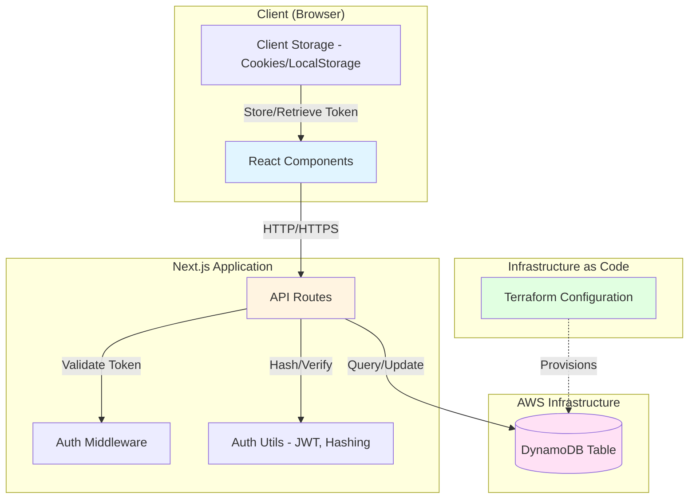
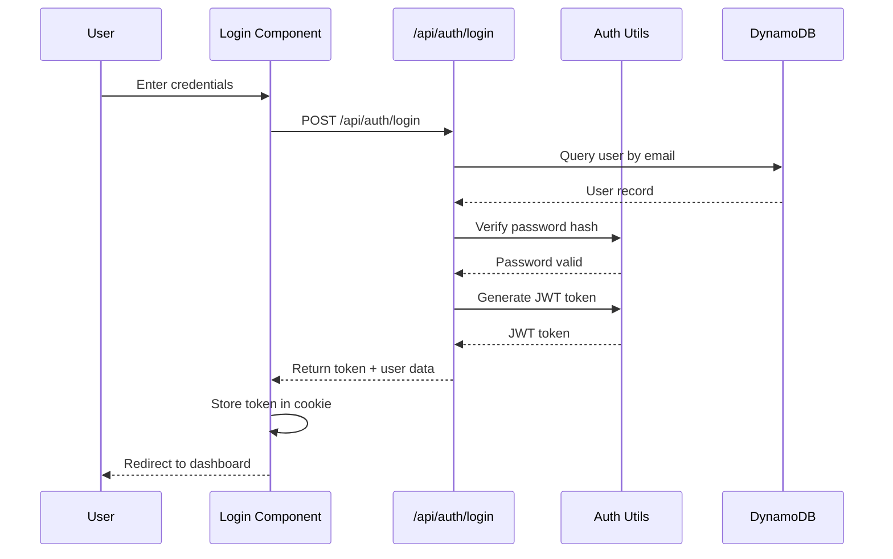

e# Design Document: User Authentication

## Overview

This design describes a comprehensive user authentication system for a Next.js application with the following key components:

- **Frontend Authentication UI**: React components for login, logout, and profile management
- **Authentication Logic**: Client-side and server-side authentication handling using Next.js API routes
- **Session Management**: JWT-based token authentication with secure storage
- **Data Persistence**: AWS DynamoDB for user data storage
- **Infrastructure**: Terraform configuration for provisioning DynamoDB resources
- **Security**: Password hashing, HTTPS enforcement, CSRF protection, and rate limiting

The system follows a modern web application architecture with clear separation between presentation (React components), business logic (API routes), and data storage (DynamoDB).

## Architecture

### High-Level Architecture



### Authentication Flow



### Technology Stack

- **Frontend**: Next.js 14+ (App Router), React, TypeScript, Tailwind CSS
- **Backend**: Next.js API Routes (serverless functions)
- **Authentication**: JWT (jsonwebtoken library)
- **Password Hashing**: bcrypt
- **Database**: AWS DynamoDB
- **AWS SDK**: @aws-sdk/client-dynamodb, @aws-sdk/lib-dynamodb
- **Infrastructure**: Terraform (AWS Provider)
- **Security**: HTTPS, HTTP-only cookies, CSRF tokens

## Components and Interfaces

### 1. Frontend Components

#### LoginForm Component
```typescript
interface LoginFormProps {
  onSuccess?: () => void;
  redirectTo?: string;
}

interface LoginFormState {
  email: string;
  password: string;
  error: string | null;
  isLoading: boolean;
}

// Component handles:
// - Form validation
// - API call to /api/auth/login
// - Error display
// - Loading states
// - Redirect on success
```

#### LogoutButton Component
```typescript
interface LogoutButtonProps {
  className?: string;
  onLogout?: () => void;
}

// Component handles:
// - API call to /api/auth/logout
// - Token removal
// - Redirect to login page
```

#### ProfileForm Component
```typescript
interface ProfileFormProps {
  user: User;
  onUpdate?: (user: User) => void;
}

interface ProfileFormState {
  name: string;
  email: string;
  bio?: string;
  error: string | null;
  isLoading: boolean;
  successMessage: string | null;
}

// Component handles:
// - Display current profile data
// - Form validation
// - API call to /api/profile/update
// - Success/error feedback
```

### 2. API Routes

#### POST /api/auth/login
```typescript
interface LoginRequest {
  email: string;
  password: string;
}

interface LoginResponse {
  success: boolean;
  token?: string;
  user?: {
    id: string;
    email: string;
    name: string;
  };
  error?: string;
}

// Endpoint handles:
// 1. Validate input (email format, non-empty fields)
// 2. Query DynamoDB for user by email
// 3. Verify password hash using bcrypt
// 4. Generate JWT token with user ID and expiration
// 5. Set HTTP-only cookie with token
// 6. Return user data (excluding password)
```

#### POST /api/auth/logout
```typescript
interface LogoutResponse {
  success: boolean;
}

// Endpoint handles:
// 1. Clear authentication cookie
// 2. Return success response
```

#### GET /api/profile
```typescript
interface ProfileResponse {
  success: boolean;
  user?: User;
  error?: string;
}

// Endpoint handles:
// 1. Validate JWT token from cookie
// 2. Extract user ID from token
// 3. Query DynamoDB for user profile
// 4. Return user data (excluding password)
```

#### PUT /api/profile/update
```typescript
interface UpdateProfileRequest {
  name?: string;
  email?: string;
  bio?: string;
}

interface UpdateProfileResponse {
  success: boolean;
  user?: User;
  error?: string;
}

// Endpoint handles:
// 1. Validate JWT token
// 2. Validate input data (email format, etc.)
// 3. Update DynamoDB record
// 4. Update lastModified timestamp
// 5. Return updated user data
```

### 3. Authentication Utilities

#### JWT Token Management
```typescript
interface TokenPayload {
  userId: string;
  email: string;
  iat: number;  // issued at
  exp: number;  // expiration
}

function generateToken(userId: string, email: string): string;
function verifyToken(token: string): TokenPayload | null;
function getTokenFromRequest(req: NextRequest): string | null;
```

#### Password Hashing
```typescript
async function hashPassword(password: string): Promise<string>;
async function verifyPassword(password: string, hash: string): Promise<boolean>;
```

#### Middleware
```typescript
// Authentication middleware for protected routes
async function withAuth(
  handler: (req: NextRequest, userId: string) => Promise<Response>
): Promise<Response>;

// Rate limiting middleware
async function withRateLimit(
  handler: (req: NextRequest) => Promise<Response>,
  maxRequests: number,
  windowMs: number
): Promise<Response>;
```

### 4. Database Layer

#### DynamoDB Schema
```typescript
interface UserRecord {
  userId: string;           // Primary Key (Partition Key)
  email: string;            // Global Secondary Index
  passwordHash: string;
  name: string;
  bio?: string;
  createdAt: string;        // ISO 8601 timestamp
  lastModified: string;     // ISO 8601 timestamp
}
```

#### Database Operations
```typescript
interface UserRepository {
  createUser(email: string, passwordHash: string, name: string): Promise<UserRecord>;
  getUserById(userId: string): Promise<UserRecord | null>;
  getUserByEmail(email: string): Promise<UserRecord | null>;
  updateUser(userId: string, updates: Partial<UserRecord>): Promise<UserRecord>;
  deleteUser(userId: string): Promise<void>;
}
```

## Data Models

### User Model
```typescript
interface User {
  id: string;
  email: string;
  name: string;
  bio?: string;
  createdAt: Date;
  lastModified: Date;
}

// Password hash is never exposed in this model
// Only used internally in database operations
```

### Session Model
```typescript
interface Session {
  token: string;
  userId: string;
  expiresAt: Date;
}

// Sessions are stateless (JWT-based)
// No session storage in database
// Token contains all necessary information
```

### Validation Rules
```typescript
const ValidationRules = {
  email: {
    pattern: /^[^\s@]+@[^\s@]+\.[^\s@]+$/,
    maxLength: 255
  },
  password: {
    minLength: 8,
    maxLength: 128,
    // Should contain at least one letter and one number (optional enforcement)
  },
  name: {
    minLength: 1,
    maxLength: 100
  },
  bio: {
    maxLength: 500
  }
};
```

## Infrastructure Configuration

### Terraform DynamoDB Table

```hcl
# terraform/dynamodb.tf

resource "aws_dynamodb_table" "users" {
  name           = "users-${var.environment}"
  billing_mode   = "PAY_PER_REQUEST"  # On-demand pricing
  hash_key       = "userId"

  attribute {
    name = "userId"
    type = "S"
  }

  attribute {
    name = "email"
    type = "S"
  }

  # Global Secondary Index for email lookups
  global_secondary_index {
    name            = "EmailIndex"
    hash_key        = "email"
    projection_type = "ALL"
  }

  # Enable point-in-time recovery
  point_in_time_recovery {
    enabled = true
  }

  # Enable encryption at rest
  server_side_encryption {
    enabled = true
  }

  tags = {
    Name        = "Users Table"
    Environment = var.environment
    ManagedBy   = "Terraform"
    Application = "UserAuthentication"
  }
}

# Output the table name for application configuration
output "dynamodb_users_table_name" {
  value       = aws_dynamodb_table.users.name
  description = "Name of the DynamoDB users table"
}

output "dynamodb_users_table_arn" {
  value       = aws_dynamodb_table.users.arn
  description = "ARN of the DynamoDB users table"
}
```

### Terraform Variables
```hcl
# terraform/variables.tf

variable "environment" {
  description = "Environment name (dev, staging, prod)"
  type        = string
  default     = "dev"
}

variable "aws_region" {
  description = "AWS region for resources"
  type        = string
  default     = "us-east-1"
}
```

### Environment Configuration
```typescript
// lib/config.ts

interface Config {
  dynamoDbTableName: string;
  awsRegion: string;
  jwtSecret: string;
  jwtExpirationHours: number;
  rateLimitMaxRequests: number;
  rateLimitWindowMs: number;
}

export const config: Config = {
  dynamoDbTableName: process.env.DYNAMODB_TABLE_NAME || 'users-dev',
  awsRegion: process.env.AWS_REGION || 'us-east-1',
  jwtSecret: process.env.JWT_SECRET || '', // Must be set in production
  jwtExpirationHours: 24,
  rateLimitMaxRequests: 5,
  rateLimitWindowMs: 15 * 60 * 1000, // 15 minutes
};
```


## Correctness Properties

A property is a characteristic or behavior that should hold true across all valid executions of a system—essentially, a formal statement about what the system should do. Properties serve as the bridge between human-readable specifications and machine-verifiable correctness guarantees.

### Authentication Properties

**Property 1: Valid credentials create authenticated sessions**
*For any* valid user credentials (email and password), when submitted to the login endpoint, the system should create a session token, store it securely on the client, and grant access to protected resources.
**Validates: Requirements 1.1, 1.5, 1.6**

**Property 2: Invalid credentials are rejected consistently**
*For any* invalid credentials (wrong email, wrong password, or both), the login attempt should be rejected with an error message that does not reveal which credential was incorrect.
**Validates: Requirements 1.2, 1.7**

**Property 3: Logout invalidates sessions completely**
*For any* authenticated session, when logout is initiated, the system should invalidate the session token, remove it from client storage, and prevent further access to protected resources using that token.
**Validates: Requirements 2.1, 2.2, 2.3**

**Property 4: Expired tokens require re-authentication**
*For any* token with an expiration timestamp in the past, attempts to access protected resources should be denied and require re-authentication.
**Validates: Requirements 4.1**

**Property 5: Token validation protects all resources**
*For any* protected resource and any request, access should be granted only when a valid, non-expired token is present; otherwise, access should be denied and redirect to login.
**Validates: Requirements 4.2, 4.3**

**Property 6: Tokens have consistent expiration**
*For any* generated authentication token, the expiration time should be set to exactly 24 hours from the time of creation.
**Validates: Requirements 4.4**

### Profile Management Properties

**Property 7: Authenticated users can retrieve their profiles**
*For any* authenticated user, requesting their profile should return their current profile data from DynamoDB matching their user ID.
**Validates: Requirements 3.1**

**Property 8: Valid profile updates persist to database**
*For any* authenticated user and valid profile update data (name, email, bio), the update should be persisted to DynamoDB and the lastModified timestamp should be updated to the current time.
**Validates: Requirements 3.2, 3.5**

**Property 9: Invalid profile updates are rejected**
*For any* profile update with invalid data (malformed email, exceeding length limits, etc.), the update should be rejected with validation errors and the profile should remain unchanged.
**Validates: Requirements 3.3**

**Property 10: Email validation is enforced**
*For any* email address update, the system should validate the email format using a regex pattern before persisting, rejecting invalid formats.
**Validates: Requirements 3.4**

**Property 11: Unauthenticated access to profiles is denied**
*For any* request to profile endpoints without a valid authentication token, access should be denied.
**Validates: Requirements 3.6**

### Data Security Properties

**Property 12: Passwords are always hashed**
*For any* user creation or password update, the password should be hashed using bcrypt before storage, and the plain text password should never be stored in DynamoDB.
**Validates: Requirements 5.1, 5.3, 5.4**

**Property 13: User queries use correct primary key**
*For any* user data query, the system should use the userId as the primary key for DynamoDB lookups.
**Validates: Requirements 5.5**

**Property 14: User records include timestamps**
*For any* user record in DynamoDB, it should contain both createdAt and lastModified timestamps in ISO 8601 format.
**Validates: Requirements 5.6**

**Property 15: Rate limiting prevents brute force**
*For any* sequence of login attempts from the same source exceeding the rate limit (5 requests per 15 minutes), subsequent requests should be rejected with a rate limit error.
**Validates: Requirements 7.2, 7.3**

**Property 16: User inputs are sanitized**
*For any* user input (email, name, bio, password), the system should sanitize the input to prevent injection attacks before processing or storage.
**Validates: Requirements 7.4**

**Property 17: Error messages don't leak sensitive information**
*For any* error response, the message should not contain sensitive details such as whether a user exists, database structure, or internal system information.
**Validates: Requirements 7.6**

### UI Component Properties

**Property 18: Form validation provides clear feedback**
*For any* form submission with validation errors, the UI should display clear error messages near the relevant fields indicating what needs to be corrected.
**Validates: Requirements 8.4**

**Property 19: Async operations show loading states**
*For any* authentication operation in progress (login, logout, profile update), the UI should display a loading indicator until the operation completes.
**Validates: Requirements 8.5**

**Property 20: Successful operations provide confirmation**
*For any* successful state-changing operation (login, profile update), the UI should display a success message confirming the action.
**Validates: Requirements 8.6**

## Error Handling

### Error Categories

1. **Validation Errors**: Input data fails validation rules
   - HTTP 400 Bad Request
   - Return specific field errors
   - Example: `{ error: "Invalid email format", field: "email" }`

2. **Authentication Errors**: Invalid credentials or missing/invalid tokens
   - HTTP 401 Unauthorized
   - Generic error messages for security
   - Example: `{ error: "Invalid credentials" }`

3. **Authorization Errors**: Valid token but insufficient permissions
   - HTTP 403 Forbidden
   - Example: `{ error: "Access denied" }`

4. **Rate Limiting Errors**: Too many requests
   - HTTP 429 Too Many Requests
   - Include retry-after header
   - Example: `{ error: "Too many requests, please try again later" }`

5. **Server Errors**: Database failures, internal errors
   - HTTP 500 Internal Server Error
   - Log detailed error server-side
   - Return generic message to client
   - Example: `{ error: "An error occurred, please try again" }`

### Error Handling Strategy

```typescript
// Centralized error handler
class AuthError extends Error {
  constructor(
    message: string,
    public statusCode: number,
    public field?: string
  ) {
    super(message);
    this.name = 'AuthError';
  }
}

// Usage in API routes
try {
  // Operation
} catch (error) {
  if (error instanceof AuthError) {
    return NextResponse.json(
      { error: error.message, field: error.field },
      { status: error.statusCode }
    );
  }
  
  // Log unexpected errors
  console.error('Unexpected error:', error);
  
  return NextResponse.json(
    { error: 'An error occurred' },
    { status: 500 }
  );
}
```

### Retry Logic

- **Client-side**: Implement exponential backoff for 5xx errors
- **Rate limiting**: Respect retry-after headers
- **Token expiration**: Automatically redirect to login, don't retry

## Testing Strategy

### Dual Testing Approach

This system requires both unit tests and property-based tests for comprehensive coverage:

- **Unit tests**: Verify specific examples, edge cases, and error conditions
- **Property-based tests**: Verify universal properties across all inputs

Both testing approaches are complementary and necessary. Unit tests catch concrete bugs in specific scenarios, while property-based tests verify general correctness across a wide range of inputs.

### Property-Based Testing

**Library**: We will use **fast-check** for TypeScript property-based testing.

**Configuration**:
- Each property test must run a minimum of 100 iterations
- Each test must include a comment tag referencing the design property
- Tag format: `// Feature: user-authentication, Property N: [property text]`

**Example Property Test**:
```typescript
import fc from 'fast-check';

// Feature: user-authentication, Property 1: Valid credentials create authenticated sessions
test('valid credentials create authenticated sessions', async () => {
  await fc.assert(
    fc.asyncProperty(
      fc.emailAddress(),
      fc.string({ minLength: 8, maxLength: 128 }),
      async (email, password) => {
        // Create user
        const hashedPassword = await hashPassword(password);
        await createUser(email, hashedPassword, 'Test User');
        
        // Login
        const response = await loginUser(email, password);
        
        // Verify session created
        expect(response.token).toBeDefined();
        expect(response.user.email).toBe(email);
        
        // Verify token stored and grants access
        const protectedResponse = await accessProtectedResource(response.token);
        expect(protectedResponse.success).toBe(true);
      }
    ),
    { numRuns: 100 }
  );
});
```

### Unit Testing

**Framework**: Jest with React Testing Library for components

**Focus Areas**:
- Edge cases (empty inputs, boundary values)
- Error conditions (network failures, invalid responses)
- Component rendering and user interactions
- Integration between components and API routes

**Example Unit Test**:
```typescript
describe('LoginForm', () => {
  it('should display error for empty email', async () => {
    render(<LoginForm />);
    
    const passwordInput = screen.getByLabelText(/password/i);
    const submitButton = screen.getByRole('button', { name: /log in/i });
    
    await userEvent.type(passwordInput, 'password123');
    await userEvent.click(submitButton);
    
    expect(screen.getByText(/email is required/i)).toBeInTheDocument();
  });
  
  it('should display error for empty password', async () => {
    render(<LoginForm />);
    
    const emailInput = screen.getByLabelText(/email/i);
    const submitButton = screen.getByRole('button', { name: /log in/i });
    
    await userEvent.type(emailInput, 'test@example.com');
    await userEvent.click(submitButton);
    
    expect(screen.getByText(/password is required/i)).toBeInTheDocument();
  });
});
```

### Test Coverage Goals

- **API Routes**: 90%+ coverage with property tests for core logic
- **Components**: 80%+ coverage with unit tests for UI behavior
- **Utilities**: 95%+ coverage with property tests for pure functions
- **Integration**: End-to-end tests for critical user flows

### Testing Infrastructure

**Test Environment**:
- Use DynamoDB Local for testing (avoid AWS costs)
- Mock AWS SDK calls in unit tests
- Use test database for integration tests

**CI/CD Integration**:
- Run all tests on every pull request
- Require passing tests before merge
- Generate coverage reports

**Property Test Mapping**:
Each correctness property must be implemented by a single property-based test:
- Property 1 → test_valid_credentials_create_sessions
- Property 2 → test_invalid_credentials_rejected
- Property 3 → test_logout_invalidates_sessions
- (Continue for all 20 properties)
