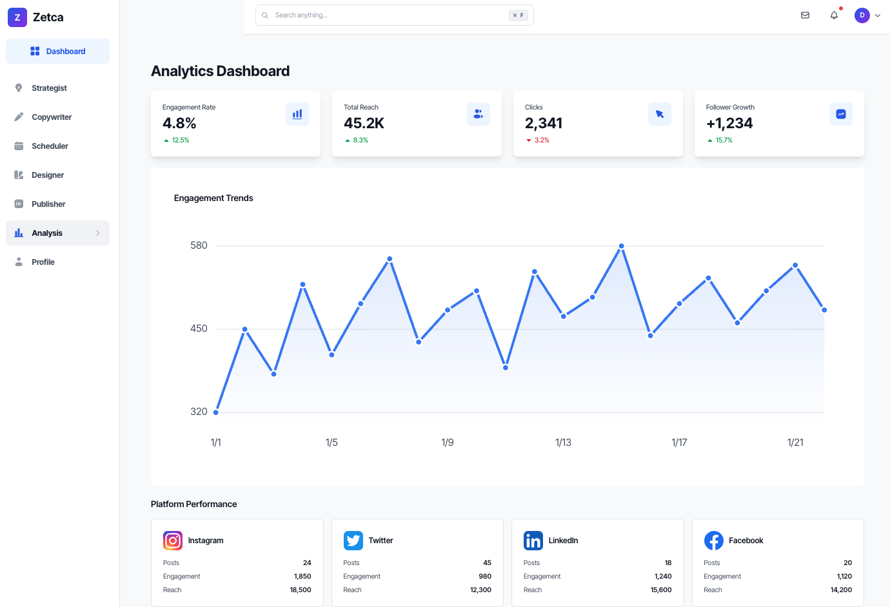

# Zetca AI Social Media Automation Platform

A production-grade web application that provides AI-powered social media automation capabilities, built with a microservices architecture.



## Architecture

The platform consists of two services:

- **Next.js Frontend** (port 3000) — App Router-based UI handling authentication, dashboard, and all user-facing pages. Proxies `/api/strategy/*` requests to the Python backend.
- **Python Agent Service** (port 8000) — FastAPI service hosting a Strands Agents-powered Strategist Agent that generates social media strategies via Amazon Bedrock (Claude Sonnet). Manages strategy persistence in DynamoDB.

Both services share a JWT secret for authentication and connect to the same DynamoDB tables.

```
Browser → Next.js (3000) → /api/strategy/* proxy → Python FastAPI (8000) → Bedrock / DynamoDB
```

## Tech Stack

- **Frontend**: Next.js 16 (App Router), TypeScript, Tailwind CSS, Iconify Solar
- **Backend**: Python 3.11, FastAPI, Strands Agents SDK, Pydantic
- **AI**: Amazon Bedrock (Claude Sonnet) via Strands Agents
- **Database**: DynamoDB (users, strategies tables)
- **Infra**: Docker, Docker Compose, Terraform (DynamoDB provisioning)
- **Testing**: Jest, React Testing Library, fast-check, pytest, Hypothesis

## Getting Started

### Prerequisites

- Node.js 18+
- Python 3.11+
- AWS account with Bedrock access enabled
- AWS credentials configured (for DynamoDB and Bedrock)

### 1. Frontend Setup

```bash
npm install
cp .env.local.example .env.local
# Edit .env.local with your JWT_SECRET and other values
npm run dev
```

### 2. Python Backend Setup

```bash
cd python
python -m venv venv
source venv/bin/activate
pip install -r requirements.txt
cp .env.example .env
# Edit .env with your AWS credentials, JWT_SECRET, etc.
uvicorn main:app --reload --port 8000
```

### 3. Running Both Services with Docker Compose

```bash
# Make sure .env.local and python/.env are configured
docker-compose up --build
```

This starts the frontend on `http://localhost:3000` and the backend on `http://localhost:8000`.

### Environment Variables

**Frontend** (`.env.local`):
| Variable | Description |
|---|---|
| `JWT_SECRET` | Shared secret for JWT token signing/validation |
| `PYTHON_SERVICE_URL` | Python backend URL (default: `http://localhost:8000`) |

**Backend** (`python/.env`):
| Variable | Description |
|---|---|
| `AWS_REGION` | AWS region (default: `us-east-1`) |
| `AWS_ACCESS_KEY_ID` | AWS access key |
| `AWS_SECRET_ACCESS_KEY` | AWS secret key |
| `JWT_SECRET` | Must match the frontend's JWT_SECRET |
| `BEDROCK_MODEL_ID` | Bedrock model (default: `anthropic.claude-sonnet-4-6`) |
| `DYNAMODB_STRATEGIES_TABLE` | DynamoDB table name (default: `strategies-dev`) |
| `FRONTEND_URL` | Frontend origin for CORS (default: `http://localhost:3000`) |
| `USE_MOCK_AGENT` | Set `true` to skip Bedrock and use a mock agent |

## Project Structure

```
zetca-platform/
├── app/              # Next.js App Router pages
├── components/       # Reusable React components
├── types/           # TypeScript type definitions (shared strategy types)
├── data/            # Mock data JSON files
├── hooks/           # Custom React hooks
├── context/         # React Context providers (Auth, Agent)
├── lib/             # Utility functions and API clients
├── python/          # Python Agent Service (FastAPI)
│   ├── main.py          # FastAPI entry point
│   ├── config.py        # Pydantic settings
│   ├── models/          # Pydantic data models
│   ├── services/        # Agent and business logic
│   ├── routes/          # API route handlers
│   ├── repositories/    # DynamoDB data access
│   ├── middleware/       # JWT auth middleware
│   └── tests/           # pytest + Hypothesis tests
├── terraform/       # Infrastructure as Code (DynamoDB tables)
└── docker-compose.yml
```

## Available Scripts

**Frontend:**
- `npm run dev` — Start Next.js dev server
- `npm run build` — Build for production
- `npm run start` — Start production server
- `npm run lint` — Run ESLint
- `npm run type-check` — Run TypeScript type checking

**Backend:**
- `uvicorn main:app --reload --port 8000` — Start FastAPI dev server (from `python/`)
- `pytest` — Run Python tests (from `python/`)

**Docker:**
- `docker-compose up --build` — Build and start both services
- `docker-compose down` — Stop all services

## API Endpoints (Python Service)

| Method | Path | Auth | Description |
|---|---|---|---|
| `POST` | `/api/strategy/generate` | JWT | Generate a new strategy |
| `GET` | `/api/strategy/list` | JWT | List user's saved strategies |
| `GET` | `/api/strategy/{id}` | JWT | Get a specific strategy |
| `GET` | `/health` | No | Health check |

## Features

- AI Strategy Generator (Strands Agent + Bedrock)
- Smart Copywriting
- Content Scheduler
- Image Designer
- Content Publisher
- Analytics Dashboard
- Profile Management

## Troubleshooting

**Python service won't start**
- Verify your virtual environment is activated: `source python/venv/bin/activate`
- Check all dependencies are installed: `pip install -r python/requirements.txt`
- Ensure `python/.env` exists and has valid values

**"Could not connect to Bedrock" / 503 errors**
- Confirm `AWS_ACCESS_KEY_ID`, `AWS_SECRET_ACCESS_KEY`, and `AWS_REGION` are set correctly in `python/.env`
- Verify Bedrock model access is enabled in your AWS account for the configured region
- Try setting `USE_MOCK_AGENT=true` to bypass Bedrock and test the rest of the flow

**401 Unauthorized on strategy endpoints**
- Ensure `JWT_SECRET` is identical in both `.env.local` (frontend) and `python/.env` (backend)
- Log in again to get a fresh token — tokens expire

**CORS errors in browser console**
- Check that `FRONTEND_URL` in `python/.env` matches the origin your frontend is running on (e.g., `http://localhost:3000`)

**Strategy generation times out (504)**
- The default timeout is 60 seconds. Bedrock can be slow on first calls. Retry once.
- Increase `AGENT_TIMEOUT_SECONDS` in `python/.env` if needed

**DynamoDB errors**
- Ensure the strategies table exists. Provision it with: `cd terraform && terraform init && terraform apply`
- Verify `DYNAMODB_STRATEGIES_TABLE` matches the actual table name in AWS
