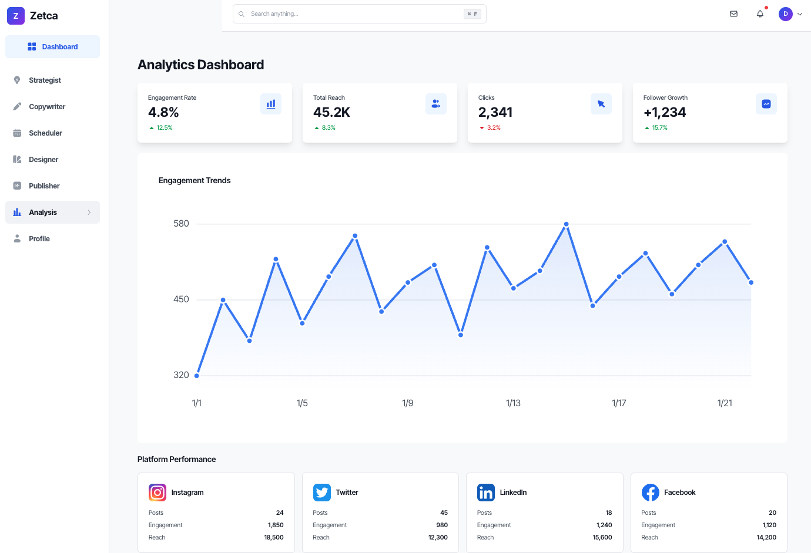

# Zetca AI Social Media Automation Platform

A production-grade web application that provides AI-powered social media automation — from strategy, to copy, to a posting calendar, to automatic publishing on LinkedIn — built with a microservices architecture.



## How It Works

Zetca chains a set of AI agents into a content pipeline. Each stage has its own dashboard page and backend API:

1. **Strategist** — generates a social media strategy from a brand's goals, audience, and platforms.
2. **Copywriter** — writes post copy for a strategy (with streaming generation, per-post chat refinement, and inline text refinement).
3. **Scheduler** — turns copy into a posting calendar, either auto-scheduled by the agent or placed manually. Posts can carry image attachments stored in S3.
4. **Publisher** — a background scanner checks for due posts and publishes them to LinkedIn using the user's connected LinkedIn account, recording every attempt in a publish log. Posts can also be published on demand.

## Architecture

The platform consists of two services plus a reverse proxy:

- **Next.js Frontend** (port 3000) — App Router-based UI. Also owns authentication (signup/login/logout with JWT + bcrypt), LinkedIn OAuth, profile management, and media upload (S3 presigned URLs).
- **Python Agent Service** (port 8000) — FastAPI service hosting the Strategist, Copywriter, and Scheduler agents (built with the Strands Agents SDK on Amazon Bedrock / Claude Sonnet) and the Publisher background task.
- **Caddy** (production only) — routes `/api/strategy`, `/api/copy`, `/api/scheduler`, and `/api/publisher` to the backend, everything else to the frontend, and provisions HTTPS automatically when a domain is set.

Both services share a JWT secret for authentication and use the same DynamoDB tables.

```
                    ┌─ /api/{strategy,copy,scheduler,publisher}/* ─→ Python FastAPI (8000) ─→ Bedrock / DynamoDB / LinkedIn
Browser → Caddy ────┤
                    └─ everything else ─────────────────────────────→ Next.js (3000) ─→ DynamoDB / S3 / LinkedIn OAuth
```

In local development (`npm run dev`) there is no Caddy; `next.config.ts` rewrites the backend paths to `http://localhost:8000` instead.

## Tech Stack

- **Frontend**: Next.js 16 (App Router), React 19, TypeScript, Tailwind CSS, Iconify Solar
- **Backend**: Python 3.11, FastAPI, Strands Agents SDK, Pydantic
- **AI**: Amazon Bedrock (Claude Sonnet) via Strands Agents
- **Integrations**: LinkedIn (OAuth 2.0 / OpenID Connect + Share on LinkedIn)
- **Storage**: DynamoDB (users, strategies, copies, scheduled posts, publish log, post media), S3 (post media)
- **Infra**: Docker, Docker Compose, Caddy, Terraform
- **Testing**: Jest, React Testing Library, fast-check, pytest, Hypothesis

## Getting Started

### Prerequisites

- Node.js 18+
- Python 3.11+
- AWS account with Bedrock access enabled
- AWS credentials configured (for DynamoDB, S3, and Bedrock)
- A LinkedIn developer app (only needed for LinkedIn connection and publishing)

### 1. Provision Infrastructure

```bash
cd terraform
terraform init
terraform apply
```

This creates the DynamoDB tables (`users`, `strategies`, `copies`, `scheduled-posts`, `publish-log`, `post-media`, each suffixed with the environment, e.g. `-dev`) and the `zetca-post-media-<env>` S3 bucket.

### 2. Frontend Setup

```bash
npm install
cp .env.local.example .env.local
# Edit .env.local with your JWT_SECRET, AWS, and LinkedIn values
npm run dev
```

### 3. Python Backend Setup

```bash
cd python
python -m venv venv
source venv/bin/activate
pip install -r requirements.txt
cp .env.example .env
# Edit .env with your AWS credentials, JWT_SECRET, etc.
uvicorn main:app --reload --port 8000
```

Set `USE_MOCK_AGENT=true` to run every agent against mock implementations, without calling Bedrock.

### 4. Running Everything with Docker Compose

```bash
# Make sure .env.local and python/.env are configured
docker-compose up --build
```

This starts Caddy on ports 80/443, fronting the frontend and backend containers. Set `DOMAIN=yourdomain.com` to get automatic HTTPS via Let's Encrypt; leave it unset to serve plain HTTP on port 80.

### Environment Variables

**Frontend** (`.env.local`):
| Variable | Description |
|---|---|
| `JWT_SECRET` | Shared secret for JWT token signing/validation |
| `AWS_REGION` | AWS region (default: `us-east-1`) |
| `AWS_ACCESS_KEY_ID` / `AWS_SECRET_ACCESS_KEY` | AWS credentials (omit if using IAM roles) |
| `DYNAMODB_TABLE_NAME` | Users table name (e.g. `users-dev`) |
| `DYNAMODB_SCHEDULED_POSTS_TABLE_NAME` | Scheduled posts table (default: `scheduled-posts-dev`) |
| `DYNAMODB_MEDIA_TABLE_NAME` | Post media table (default: `post-media-dev`) |
| `S3_MEDIA_BUCKET` | Post media bucket (default: `zetca-post-media-dev`) |
| `LINKEDIN_CLIENT_ID` / `LINKEDIN_CLIENT_SECRET` | LinkedIn app credentials |
| `LINKEDIN_REDIRECT_URI` | OAuth callback (default: `http://localhost:3000/api/auth/linkedin/callback`) |

**Backend** (`python/.env`):
| Variable | Description |
|---|---|
| `AWS_REGION` | AWS region (default: `us-east-1`) |
| `AWS_ACCESS_KEY_ID` / `AWS_SECRET_ACCESS_KEY` | AWS credentials |
| `JWT_SECRET` | Must match the frontend's `JWT_SECRET` |
| `BEDROCK_MODEL_ID` | Bedrock model (default: `us.anthropic.claude-sonnet-4-6`) |
| `DYNAMODB_USERS_TABLE` | Default: `users-dev` |
| `DYNAMODB_STRATEGIES_TABLE` | Default: `strategies-dev` |
| `DYNAMODB_COPIES_TABLE` | Default: `copies-dev` |
| `DYNAMODB_SCHEDULED_POSTS_TABLE` | Default: `scheduled-posts-dev` |
| `DYNAMODB_PUBLISH_LOG_TABLE` | Default: `publish-log-dev` |
| `DYNAMODB_MEDIA_TABLE` | Default: `post-media-dev` |
| `S3_MEDIA_BUCKET` | Default: `zetca-post-media-dev` |
| `FRONTEND_URL` | Frontend origin for CORS (default: `http://localhost:3000`) |
| `USE_MOCK_AGENT` | Set `true` to skip Bedrock and use mock agents |
| `AGENT_TIMEOUT_SECONDS` | Agent call timeout (default: `60`) |
| `PUBLISHER_ENABLED` | Run the background publish scanner (default: `true`) |
| `PUBLISHER_SCAN_INTERVAL_SECONDS` | How often to scan for due posts (default: `60`) |
| `LINKEDIN_API_TIMEOUT_SECONDS` | LinkedIn API timeout (default: `30`) |

## Project Structure

```
zetca-platform/
├── app/              # Next.js App Router pages
│   ├── dashboard/        # strategist, copywriter, scheduler, publisher, designer, analysis, profile
│   └── api/              # auth (incl. LinkedIn OAuth), profile, media routes
├── components/       # Reusable React components
├── context/          # React Context providers (Auth, Agent)
├── lib/              # API clients, auth, DynamoDB, media helpers, config
├── types/            # Shared TypeScript types
├── data/             # Mock data JSON files
├── python/           # Python Agent Service (FastAPI)
│   ├── main.py           # FastAPI entry point (starts the publish scanner)
│   ├── config.py         # Pydantic settings
│   ├── models/           # Pydantic models (strategy, copy, scheduler, publisher)
│   ├── services/         # Agents, mock agents, LinkedIn client, publish scanner
│   ├── routes/           # API route handlers
│   ├── repositories/     # DynamoDB / S3 data access
│   ├── middleware/       # JWT auth middleware
│   └── tests/            # pytest + Hypothesis tests
├── terraform/        # DynamoDB tables and S3 bucket
├── .kiro/specs/      # Feature specs (requirements, design, tasks)
├── Caddyfile         # Production reverse proxy config
└── docker-compose.yml
```

## Available Scripts

**Frontend:**
- `npm run dev` — Start Next.js dev server
- `npm run build` — Build for production
- `npm run start` — Start production server
- `npm run lint` — Run ESLint
- `npm run type-check` — Run TypeScript type checking
- `npm test` — Run Jest tests

**Backend:**
- `uvicorn main:app --reload --port 8000` — Start FastAPI dev server (from `python/`)
- `pytest` — Run Python tests (from `python/`)

**Docker:**
- `docker-compose up --build` — Build and start all services
- `docker-compose down` — Stop all services

## API Endpoints

All endpoints except `/health` require a JWT.

### Python Service

**Strategy**
| Method | Path | Description |
|---|---|---|
| `POST` | `/api/strategy/generate` | Generate a new strategy |
| `GET` | `/api/strategy/list` | List the user's strategies |
| `GET` | `/api/strategy/{strategy_id}` | Get a strategy |

**Copy**
| Method | Path | Description |
|---|---|---|
| `POST` | `/api/copy/generate` | Generate copies for a strategy |
| `POST` | `/api/copy/generate-stream` | Generate copies with a streamed response |
| `GET` | `/api/copy/list/{strategy_id}` | List copies for a strategy |
| `GET` | `/api/copy/{copy_id}` | Get a copy |
| `POST` | `/api/copy/{copy_id}/chat` | Refine a copy through chat |
| `POST` | `/api/copy/refine-text` | Refine arbitrary text |
| `DELETE` | `/api/copy/{copy_id}` | Delete a copy |

**Scheduler**
| Method | Path | Description |
|---|---|---|
| `POST` | `/api/scheduler/auto-schedule` | Let the agent schedule a strategy's copies |
| `POST` | `/api/scheduler/manual-schedule` | Schedule a single post manually |
| `GET` | `/api/scheduler/posts` | List the user's scheduled posts |
| `GET` | `/api/scheduler/posts/strategy/{strategy_id}` | List scheduled posts for a strategy |
| `GET` | `/api/scheduler/posts/{post_id}` | Get a scheduled post |
| `PUT` | `/api/scheduler/posts/{post_id}` | Update a scheduled post |
| `DELETE` | `/api/scheduler/posts/{post_id}` | Delete a scheduled post |
| `DELETE` | `/api/scheduler/posts/clear-all` | Delete all of the user's scheduled posts |

**Publisher**
| Method | Path | Description |
|---|---|---|
| `GET` | `/api/publisher/logs` | List the user's publish attempts |
| `GET` | `/api/publisher/logs/{post_id}` | List publish attempts for a post |
| `POST` | `/api/publisher/publish/{post_id}` | Publish a post immediately |

**Health**
| Method | Path | Description |
|---|---|---|
| `GET` | `/health` | Health check (no auth) |

### Next.js API Routes

| Method | Path | Description |
|---|---|---|
| `POST` | `/api/auth/signup` | Create an account |
| `POST` | `/api/auth/login` | Log in |
| `POST` | `/api/auth/logout` | Log out |
| `GET` | `/api/auth/linkedin` | Start LinkedIn OAuth |
| `GET` | `/api/auth/linkedin/callback` | LinkedIn OAuth callback |
| `POST` | `/api/auth/linkedin/disconnect` | Disconnect LinkedIn |
| `GET` / `PUT` | `/api/profile` | Read / update profile |
| `POST` | `/api/media/upload-url` | Get a presigned S3 upload URL |
| `POST` | `/api/media/{mediaId}/validate` | Validate an uploaded file |
| `GET` | `/api/media/{mediaId}/download-url` | Get a presigned S3 download URL |
| `DELETE` | `/api/media/{mediaId}` | Delete a media file |

## Features

- AI Strategy Generator (Strands Agent + Bedrock)
- Smart Copywriting with chat-based refinement
- Content Scheduler (auto and manual) with image attachments
- LinkedIn connection and automatic publishing with publish logs
- Profile Management
- Image Designer *(UI only — currently returns mock images)*
- Analytics Dashboard *(UI only — currently uses mock data)*

## Troubleshooting

**Python service won't start**
- Verify your virtual environment is activated: `source python/venv/bin/activate`
- Check all dependencies are installed: `pip install -r python/requirements.txt`
- Ensure `python/.env` exists and sets at least `JWT_SECRET` (it's required)

**"Could not connect to Bedrock" / 503 errors**
- Confirm `AWS_ACCESS_KEY_ID`, `AWS_SECRET_ACCESS_KEY`, and `AWS_REGION` are set correctly in `python/.env`
- Verify Bedrock model access is enabled in your AWS account for the configured region
- Try setting `USE_MOCK_AGENT=true` to bypass Bedrock and test the rest of the flow

**401 Unauthorized on agent endpoints**
- Ensure `JWT_SECRET` is identical in both `.env.local` (frontend) and `python/.env` (backend)
- Log in again to get a fresh token — tokens expire after 24 hours

**CORS errors in browser console**
- Check that `FRONTEND_URL` in `python/.env` matches the origin your frontend is running on (e.g., `http://localhost:3000`)

**Agent requests time out (504)**
- The default timeout is 60 seconds. Bedrock can be slow on first calls. Retry once.
- Increase `AGENT_TIMEOUT_SECONDS` in `python/.env` if needed

**Posts aren't being published**
- Confirm `PUBLISHER_ENABLED` isn't set to `false` in `python/.env`
- Make sure the user has connected LinkedIn from their profile and the connection hasn't expired
- Check `/api/publisher/logs/{post_id}` for the recorded error

**DynamoDB / S3 errors**
- Ensure the tables and bucket exist: `cd terraform && terraform init && terraform apply`
- Verify the table and bucket names in both env files match what Terraform created
